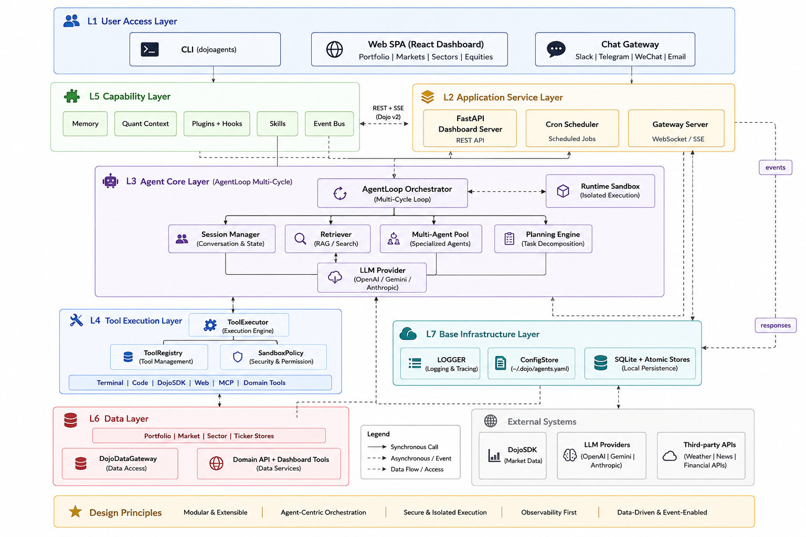

<div align="center">
    <picture>
    <source
      media="(prefers-color-scheme: dark)"
      srcset="dojoagents/dashboard/web/src/assets/images/logo.svg"
    />
    <source
      media="(prefers-color-scheme: light)"
      srcset="dojoagents/dashboard/web/src/assets/images/logo-dark.svg"
    />
    
  </picture>
</div>

<p align="center">
  <a href="https://discord.gg/CCRvSvdvr"></a>
  <a href="docs/WECHAT.md"></a>
  <a href="https://huggingface.co/AlphaDojo"></a>
  <a href="https://github.com/Alpha-Dojo/DojoAgents/blob/main/docs/README.md"></a>
</p>

---

# DojoAgents: 面向个人投资的全市场 AI 助手

DojoAgents 是一款专为个人投资打造的全市场 AI 智能体框架。它致力于填补个人投资者与机构级工具之间的鸿沟，其真正的核心壁垒在于最先进的 Agent Loop（智能体循环）引擎。DojoAgents 绝非一个简单的数据看板，它为您部署了一个与投资组合无缝伴生的自主推理智能体，全面接管从全市场数据认知到动态跨市场策略推演的复杂任务。

<div align="center">
  
  <p><em>七层架构 — 从 CLI、Web Dashboard、聊天网关，到 Agent Loop、工具执行、数据层与基础设施。</em></p>
</div>

## ✨ 为什么选择 DojoAgents？

**🧠 基于 Loop-Engineering 的认知型投资组合智能体 (核心引擎):** 绝大多数金融 AI 工具仅被设计用于生成快餐式的内容：新闻摘要、单股解析、基础指标读取或泛泛的市场评论。而我们的认知型投资组合智能体则是专为**具备持仓上下文感知的深度推理**而生。它将您的投资组合与市场数据深度互联，并在四个维度上执行结构化分析：

* **基础数据认知：** 瞬时调取、结构化并交叉验证跨市场原始数据（K线、财务报表、资讯）。
* **进阶逻辑分析：** 深度剖析估值中枢、动量指标与行业分类，揭示隐藏的市场运行机制。
* **跨市场策略推演：** 制定宏观资产配置并映射市场联动关系（例如：通过多步工具调用，自主推演 *“为什么美股半导体软件大跌，而A股同板块却涨幅明显”* 的底层逻辑）。
* **动态组合管理：** 持续诊断风险敞口、追踪净值曲线，并评估收益归因，为您的调仓决策提供更科学的依据。

**📊 四大核心看板:** 开箱即用的机构级 React 单页应用 (SPA)，包含：
- **组合分析 (核心指挥中心):** 净值曲线追踪、实时风险敞口以及智能持仓管理。
- **市场动态:** 跨市场热力图（美股/港股/A股）与核心指数追踪。
- **板块发现:** L1/L2/L3 深度行业分类与动量曲线。
- **个股分析:** K线图、PE 估值带、财务数据与新闻资讯的一站式聚合。

**🤖 自动化量化分析师:** 基于多智能体协同架构，在后台自动为您执行市场调研、追踪板块轮动，并在您休息时持续监控投资风险。

**📱 规划中的全渠道更新:** 未来的版本将支持通过 Slack、Telegram、Discord、飞书、微信或电子邮件，推送个性化的每日复盘简报与异动预警通知。

## 📈 DojoAgents 能做什么

### 1. 每日市场全景

*"今天全球市场什么值得关注？"* —— 这是投资者每天最常问的问题之一。看似简单，背后却要同时看全市场涨跌、行业轮动、个股异动、资金情绪和潜在事件。

DojoAgents 收到问题后进入数据收集阶段，调用全球市场、行业和个股相关工具，拉取 A 股、美股、港股里的异动板块、强势标的、涨跌幅、成交变化和行业分布。整个过程中，可随时展开中间步骤，查看 Agent 调用了哪些工具、引用了哪些数据、每一步分析是如何推进的。

<div align="center">
  
</div>

### 2. 突发新闻影响分析

分析突发新闻会影响哪些标的，是投资者最关心的问题之一。

比如 Meta 卖算力搅动了全球市场，A 股投资者看到消息后会自然问出：*"Meta 卖算力，会影响美股和 A 股哪些股票？"* DojoAgents 会先把问题拆开，再进入数据收集阶段，调用行情、新闻、公司和行业相关工具，拉取 Meta 的价格变化、相关新闻、市场表现，以及美股科技股、AI 算力链、半导体、云计算、广告科技等方向的数据。

<div align="center">
  
</div>

### 3. 上传持仓截图，一键组合诊断

DojoAgents 支持多模态模型能力，用户只需上传持仓截图，就能完成组合诊断 —— 无需手动录入数据。

直接上传一张包含 40 多只标的的持仓截图，横跨 A 股、美股和 ETF。DojoAgents 识别后，会按市场、行业和产业链位置重新归类，把持仓拆解成所在行业的具体方向，随后生成组合风险诊断，指出是否存在赛道过度集中、内部持仓高度重叠、防御性资产不足等问题。结论非常直接：虽然组合里有 40 多只标的，但很多仓位本质上都押注在同一个方向上，一旦半导体、AI 算力或成长股整体回调，组合很容易同步下跌。

<div align="center">
  
</div>

### 4. 根据优化建议生成模拟组合

诊断完成后，Agent 会给出后续策略，例如精简重复仓位、保留核心标的、优化美股配置、减少弱势暴露，同时增加公用事业、消费等防御资产。等结论出来后，还可以让它根据优化建议生成新的观察组合，并在 Dashboard 中持续跟踪。

<div align="center">
  
</div>

## 🚀 快速开始

部署 DojoAgents 环境非常顺畅无阻。我们强烈建议使用 `uv` 进行极速的依赖管理。

### 1. 环境要求

- **Python** >= 3.11
- **Node.js**: >= 18 (用于构建前端)
- **npm**: >= 9
- LLM **API Key** (OpenAI、Gemini、Anthropic 等)

### 2. 核心安装

#### 快捷安装（PyPI）

大多数用户可直接安装已发布的包，无需克隆仓库或构建前端：

```bash
# macOS / Linux
uv venv && source .venv/bin/activate
uv pip install dojoagents

# Windows (PowerShell)
uv venv && .venv\Scripts\Activate.ps1
uv pip install dojoagents

# Windows (CMD)
uv venv && .venv\Scripts\activate.bat 
uv pip install dojoagents
```

然后跳至 [启动服务](#4-启动服务)。

#### 从源码安装（开发者）

运行时依赖已记录在 `pyproject.toml` 和 `requirements.txt` 中。

```bash
# 1. 创建并激活虚拟环境
uv venv && source .venv/bin/activate

# 2. 开启“可编辑模式”并安装开发工具。任何源码级别的修改都将立即生效——
# 非常适合用于构建自定义工具或调试 Agent Loop。
uv pip install -e ".[dev]"
```

### 3. 构建 Dashboard

DojoAgents Dashboard 是一个由 Vite 驱动的高性能 React SPA。它通过兼容 OpenAI 格式的 Chat API 以及 SSE 流式输出与 FastAPI 后端进行通信，并支持动态 Canvas 图表渲染。

如果您从源码进行构建，需要安装 Node.js (>= 18) 和 npm (>= 9)。

```bash
cd dojoagents/dashboard/web
npm install
npm run build
```

### 4. 启动服务

```bash
dojoagents dashboard --host 127.0.0.1 --port 8765
```

在浏览器中打开 http://127.0.0.1:8765/ 即可进入您的个人财务指挥中心。

### 5. 配置 LLM 引擎 (应用内)

Dashboard 启动后，点击设置图标。DojoAgents 提供了一个完善的图形化界面，让您能够安全地配置首选的大语言模型。

- **支持的模型供应商**: 开箱即用，预设支持 OpenAI、Anthropic、Google Gemini、智谱 GLM 和 DeepSeek。
- **本地与自定义端点**: 轻松覆盖 Base URL，连接至 Ollama、llama.cpp 或 vLLM 等本地实例。
- **安全存储**: 在 UI 中输入的所有 API Key 和端点设置，都会被安全地写入本地的 ~/.dojo/agents.yaml 文件中。

## 🧠 核心架构

如上文架构图所示，DojoAgents 专为高扩展性、深度上下文推理和绝对隐私保护而设计。

- **Agent Loop 引擎:** 核心推理运行时。负责处理多轮工具调用编排、上下文窗口压缩，以及防止金融数据幻觉的严格护栏机制。
- **执行沙盒:** 一个安全隔离的执行环境，支持动态 Python 代码执行、技术指标计算以及本地网页数据提取。
- **记忆与技能 (SKILLS):** 自动将成功的多步市场分析工作流提炼为可复用的、程序化的“技能 (SKILLS)”，供未来调用。
- **定时任务与网关 (Cron & Gateway):** 解耦的消息投递管道，将计划任务和自动化的分析洞察直接推送到您常用的聊天应用中，且不会阻塞主 Agent 推理循环。


## 📚 文档与深入指南

准备好构建自定义量化技能、接入私有数据，或是部署多智能体集群了吗？请参阅我们全面的开发者指南：

- 系统架构与设计理念
- 编写自定义插件与 Claude Skills 兼容指南
- 聊天网关与全渠道配置指南
- Dashboard UI 定制指南

## 🤝 参与贡献

我们正在构建最顶级的开源金融 AI，非常期待您的加入！请查看我们的参与贡献指南，了解如何添加新工具、优化智能体 Prompt 或扩展全市场覆盖范围。

**开源协议:** DojoAgents 采用 Apache License 2.0 开源协议。

## ⚠️ 免责声明

本项目仅供教育、研究和演示使用，不提供任何投资建议或交易推荐。交易金融工具涉及重大风险，可能导致本金亏损。所有数据、分析和输出结果仅供参考，不保证其准确性、完整性或时效性。用户需对自己的投资决策自行负责，本项目及其贡献者对因依赖本项目提供的信息而造成的任何损失不承担任何责任。第三方名称、徽标和品牌仅用于识别目的，不代表任何背书或关联关系。
