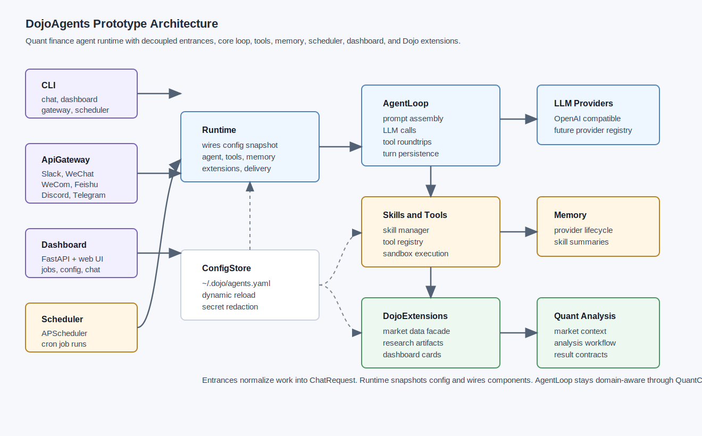

# DojoAgents Architecture Design

> Status: design prototype only. This document records the proposed code shape,
> migration candidates from `hermes-agent`, and the first implementation slice.



## 1. Context

`DojoAgents` is currently a lightweight Python package skeleton. The repository
already contains the intended top-level directories:

```text
dojoagents/
  agent/
  cli/
  cron/
  dashboard/
  dashboard/static/
  dojo_extensions/
  gateway/
  memory/
  plugins/
  skills/
  tools/
  tools/environments/
```

`pyproject.toml` already includes the right first dependencies for a prototype:
`openai`, `fastapi`, `uvicorn`, `pyyaml`, `apscheduler`, and `pandas`. The design
below keeps those dependencies and avoids adding heavy infrastructure before the
core loop is stable.

## 2. Hermes-Agent Findings

The `hermes-agent` code-review-graph was analyzed from
`/Users/kk1999/Local_Documents/code/hermes-agent`.

Key graph signals:

- Graph size: 51,473 nodes, 442,525 edges, 2,238 files.
- Major reusable communities: `agent-tool`, `tools-check`, `hermes-cli-cmd`,
  `platforms-send`, `cron-job`, `hermes-agent-session`, and
  `hermes-agent-trajectory`.
- High coupling warnings appear between gateway, tools, CLI, and tests. For
  DojoAgents, the design should keep Gateway, Tools, Scheduler, and Quant
  Analysis behind interfaces from day one.
- `agent/conversation_loop.py::run_conversation` is very large in Hermes. It is
  useful as behavioral reference, but DojoAgents should split the loop into
  smaller services.
- `agent/memory_provider.py` and `agent/memory_manager.py` are strong migration
  candidates because they already express memory as a provider lifecycle.
- `cron/jobs.py` and `cron/scheduler.py` are useful references for cron parsing,
  secure storage, due job resolution, job output persistence, and per-job
  runtime context.
- `gateway/platform_registry.py` is a good reference for chat platform adapter
  registration.
- `agent/tool_executor.py` is a useful reference for sequential/concurrent tool
  execution, callback propagation, tool result shaping, and guardrails.
- `tools/skill_manager_tool.py` is the reference for using skills as procedural
  memory, with a filesystem layout and validation model.

Migration guidance:

- Rewrite concepts, do not copy whole modules. Hermes has mature behavior, but
  its graph shows coupling accumulated around CLI/gateway/tool surfaces.
- Preserve these contracts: provider lifecycle, platform registry, tool
  execution result shape, cron job records, skill directory convention.
- Avoid porting UI-specific display, legacy environment handling, and unrelated
  media/browser tools into the first DojoAgents prototype.

## 3. Architecture Goals

DojoAgents is a quantitative finance agent runtime for stock and crypto market
analysis. The core product should answer, schedule, and deliver analysis while
keeping financial data access, analysis workflows, and chat delivery decoupled.

Primary goals:

- Run an agent loop with pluggable LLM providers.
- Install, discover, and execute skills/tools under a sandbox policy.
- Schedule recurring analysis jobs with cron-like semantics.
- Persist memory through provider plugins, with a default skill-summary memory.
- Receive and send messages through API gateway adapters.
- Expose Dojo-specific extensions for quant data and workflows.
- Provide a CLI and a Dashboard backed by a FastAPI server.
- Centralize configuration in `~/.dojo/agents.yaml` with dynamic reload.

Non-goals for this prototype:

- No concrete financial indicator implementation.
- No production trading or order execution.
- No exact migration of Hermes UI/CLI internals.
- No long-lived distributed worker system.

## 4. Proposed Package Layout

```text
dojoagents/
  agent/
    loop.py                 # AgentLoop orchestration
    models.py               # ChatRequest, AgentTurn, ToolCall, AgentResponse
    runtime.py              # Runtime wiring from config
    providers.py            # LLMProvider protocol and registry
  config/
    loader.py               # ~/.dojo/agents.yaml loading and defaults
    models.py               # typed config objects
    watcher.py              # dynamic reload hooks
  tools/
    registry.py             # ToolSpec and ToolRegistry
    executor.py             # sequential/concurrent execution facade
    sandbox.py              # filesystem/process/network policy
    environments/
      local.py              # first local sandbox environment
  skills/
    manager.py              # skill install/list/load
    loader.py               # prompt block and tool discovery from skills
  memory/
    provider.py             # MemoryProvider protocol
    manager.py              # provider registration and lifecycle fan-out
    skill_summary.py        # default memory: summarize sessions into skills
  cron/
    jobs.py                 # job model, storage, parsing
    scheduler.py            # APScheduler integration and job execution
  gateway/
    registry.py             # chat platform registry
    adapters/
      slack.py
      wechat.py
      wecom.py
      feishu.py
      discord.py
      telegram.py
    server.py               # webhook/API gateway server
  dojo_extensions/
    registry.py             # DojoExtension registry
    base.py                 # extension protocol
    research.py             # analysis workflow facade only
  quant/
    context.py              # market universe/timeframe/asset class context
    workflow.py             # analysis plan/result contracts
    risk.py                 # portfolio/risk contract placeholders
  dashboard/
    server.py               # FastAPI app
    api.py                  # dashboard routes
    static/                 # simple frontend assets
  cli/
    main.py                 # `dojoagents` commands
```

This layout follows the directories already present in the repository and adds
only the missing source boundaries.

## 5. Core Components

### AgentLoop

`AgentLoop` owns the turn lifecycle:

1. Build the system prompt from config, skills, memory, and quant context.
2. Prefetch memory for the incoming request.
3. Call the configured `LLMProvider`.
4. Dispatch tool calls through `ToolExecutor`.
5. Repeat until the model returns a final answer or budget is exhausted.
6. Persist turn memory and emit events to gateway/dashboard observers.

The loop should not know about Slack, Feishu, dashboard HTTP routes, or concrete
financial data providers. It should receive a `ChatRequest` and return an
`AgentResponse`.

LLM provider contract:

```python
class LLMProvider(Protocol):
    name: str

    async def chat(
        self,
        messages: list[dict],
        tools: list[dict],
        *,
        model: str,
        stream: bool = False,
        metadata: dict | None = None,
    ) -> "LLMResult":
        ...
```

Initial providers:

- `openai`: direct OpenAI-compatible client using the current dependency.
- `openai_compatible`: custom `base_url` and API key from config.
- Later: Anthropic, Gemini, local inference, model router.

### Skills & Tools Execution

Use Hermes as a reference, but keep DojoAgents smaller:

- `skills/manager.py` manages skill directories under `~/.dojo/skills`.
- A skill can contribute prompt instructions, tool schemas, and supporting
  assets/scripts.
- `tools/registry.py` owns registered callable tools.
- `tools/executor.py` owns execution order, timeout, result shaping, and
  concurrency.
- `tools/sandbox.py` owns allowlists: filesystem roots, shell commands,
  network policy, environment passthrough, and max runtime.

Sandbox principles:

- Default read/write scope is the workspace and configured temp directories.
- Tool calls produce structured results: `ok`, `error`, `metadata`, `content`.
- Destructive operations require explicit policy approval.
- Quant data tools should be read-only unless a later trading module is
  explicitly designed.

### Scheduler

Use APScheduler for the prototype because it is already declared in
`pyproject.toml`. Keep Hermes cron semantics as design guidance:

- Job records live under `~/.dojo/agents/jobs.yaml` or
  `~/.dojo/agents/jobs.json`.
- Output records live under `~/.dojo/agents/job_runs/{job_id}/`.
- Jobs can target channels through Gateway adapters.
- Jobs can select skill bundles, quant context, and delivery policy.
- The scheduler calls `AgentLoop` through the same runtime interface as CLI and
  Gateway.

Job shape:

```yaml
id: daily-btc-market-brief
name: Daily BTC Market Brief
enabled: true
schedule:
  kind: cron
  expr: "0 8 * * 1-5"
agent:
  profile: default
  skills: ["market-brief", "risk-check"]
quant:
  market: crypto
  symbols: ["BTC-USD", "ETH-USD"]
  timeframe: "1d"
delivery:
  platform: telegram
  target: "${TELEGRAM_HOME_CHANNEL}"
```

### Memory

DojoAgents should copy the Hermes idea of a `MemoryProvider` lifecycle:

- `initialize(session_id, **context)`
- `system_prompt_block()`
- `prefetch(query, session_id=...)`
- `queue_prefetch(query, session_id=...)`
- `sync_turn(user_content, assistant_content, session_id=...)`
- `on_session_end(messages)`
- `on_pre_compress(messages)`
- `shutdown()`

Default memory provider:

- `SkillSummaryMemoryProvider`
- Summarizes successful repeated workflows into user skills under
  `~/.dojo/skills/generated/`.
- Focuses on procedure, not raw chat logs.
- Example: "How this user evaluates BTC funding-rate divergence" becomes a
  skill with frontmatter, constraints, and reusable steps.

Extension memory providers:

- local files
- sqlite
- vector database
- external memory API
- research notebook memory

Only one external provider should be active by default. This mirrors Hermes'
one-external-provider rule and prevents conflicting recall/tool schemas.

### ApiGateway

The Gateway adapts external chat systems into `ChatRequest`:

- Slack
- WeChat
- WeCom
- Feishu
- Discord
- Telegram

Use a registry like Hermes' `PlatformRegistry`:

```python
class GatewayAdapter(Protocol):
    name: str

    async def start(self) -> None: ...
    async def stop(self) -> None: ...
    async def send(self, target: str, message: "GatewayMessage") -> None: ...
```

The Gateway should own auth, signature verification, channel/user mapping,
message normalization, and delivery. It should not own quant logic.

### DojoExtensions

DojoExtensions are domain plugins for the Dojo ecosystem. They are not generic
tools; they provide finance-aware capabilities and contracts that tools,
scheduler jobs, dashboard pages, and agent prompts can use.

Extension contract:

```python
class DojoExtension(Protocol):
    name: str
    version: str

    def health(self) -> "ExtensionHealth": ...
    def tool_specs(self) -> list["ToolSpec"]: ...
    def dashboard_cards(self) -> list["DashboardCardSpec"]: ...
    def prompt_context(self, quant_context: "QuantContext") -> str: ...
```

Initial extension categories:

- market data access facade
- symbol/universe resolver
- backtest result reader
- portfolio/risk snapshot reader
- research artifact index
- alert/event stream facade

This design intentionally does not implement indicators, factor models,
execution, or backtesting math. It defines where those capabilities will plug in.

### Quantitative Analysis

Quantitative Analysis is a first-class subsystem, not just a folder of tools.
It provides typed context so the LLM can reason with market boundaries:

- asset class: stock, crypto, ETF, futures later
- venue/source: exchange, broker, data vendor, Dojo service
- symbols/universe
- timeframe and sampling frequency
- analysis mode: market brief, signal review, risk review, anomaly review,
  scheduled digest
- provenance requirements
- freshness policy

Core contracts:

```python
@dataclass
class QuantContext:
    market: Literal["stock", "crypto"]
    symbols: list[str]
    timeframe: str
    currency: str = "USD"
    data_freshness: str = "latest_available"

@dataclass
class AnalysisResult:
    title: str
    summary: str
    observations: list[str]
    artifacts: list["ArtifactRef"]
    provenance: list["DataSourceRef"]
```

The AgentLoop injects a compact `QuantContext` into prompts and exposes
finance-specific tools from DojoExtensions. Financial computations remain inside
extensions or future quant modules, not inside Gateway or AgentLoop.

### Cli

CLI responsibilities:

- `dojoagents chat`: run a local interactive agent session.
- `dojoagents dashboard`: start the dashboard server.
- `dojoagents gateway`: start webhook/chat gateway server.
- `dojoagents scheduler`: start the scheduler loop.
- `dojoagents config get/set/edit/reload`: manage `~/.dojo/agents.yaml`.
- `dojoagents jobs list/add/run/disable`: manage scheduled jobs.
- `dojoagents skills list/install`: manage skills.

### Dashboard

Dashboard has a FastAPI backend and a simple web frontend.

Backend API:

- `GET /api/health`
- `GET /api/config`
- `PUT /api/config`
- `GET /api/jobs`
- `POST /api/jobs/{id}/run`
- `GET /api/job-runs`
- `GET /api/extensions`
- `GET /api/extensions/{name}/cards`
- `POST /api/chat`
- `GET /api/sessions/{id}`

`POST /api/chat` is the single agent entrypoint. It keeps OpenAI Chat Completions compatibility and additionally supports `metadata.event_format = "dojo.v2"` for richer typed agent events:

- streaming: standard OpenAI chunk + optional top-level `dojo_event`
- non-streaming: standard OpenAI response + optional top-level `dojo`
- compatibility: clients that ignore Dojo fields can continue reading only `choices[0]`

Frontend views:

- Overview: system health, active provider, scheduler status.
- Jobs: scheduled tasks, last run, next run, output link.
- DojoExtensions: extension health and result cards.
- Config: editable safe config fields.
- Chat: direct agent conversation with selected profile/quant context.

### Config

Default config path: `~/.dojo/agents.yaml`.

Config design:

```yaml
version: 1

llm_provider:
  default: openai
  providers:
    openai:
      model: gpt-4.1
      api_key_env: OPENAI_API_KEY
    openai_compatible:
      model: qwen-plus
      base_url: "${DOJO_OPENAI_BASE_URL}"
      api_key_env: DOJO_OPENAI_API_KEY

agent:
  max_iterations: 8
  max_tool_workers: 4
  default_skills: ["dojo-quant-analyst"]

tools:
  sandbox:
    allowed_roots:
      - "${PWD}"
      - "/tmp"
    allow_network: false
    timeout_seconds: 120

memory:
  provider: skill_summary
  generated_skill_dir: "~/.dojo/skills/generated"

scheduler:
  enabled: true
  timezone: Asia/Shanghai
  store: "~/.dojo/agents/jobs.yaml"

gateway:
  enabled: true
  hooks:
    slack:
      enabled: false
      signing_secret_env: SLACK_SIGNING_SECRET
      bot_token_env: SLACK_BOT_TOKEN
    wechat:
      enabled: false
    wecom:
      enabled: false
    feishu:
      enabled: false
    discord:
      enabled: false
    telegram:
      enabled: false

dashboard:
  host: "127.0.0.1"
  port: 8765

dojo_extensions:
  enabled:
    - dojo_research
```

Dynamic reload:

- `ConfigStore` caches parsed config with `mtime`/size.
- Dashboard and Gateway read through `ConfigStore.snapshot()`.
- Components subscribe to reload events for safe hot updates.
- Secrets remain env-var based; dashboard should not display raw secret values.

## 6. End-to-End Flow

CLI chat:

```text
CLI -> Runtime -> ConfigStore -> AgentLoop
AgentLoop -> MemoryManager.prefetch
AgentLoop -> SkillManager.prompt/tools
AgentLoop -> LLMProvider.chat
AgentLoop -> ToolExecutor -> DojoExtensions/tools
AgentLoop -> MemoryManager.sync_turn
CLI <- AgentResponse
```

Scheduled quant brief:

```text
Scheduler tick -> due Job -> Runtime profile
Runtime -> AgentLoop(ChatRequest with QuantContext)
AgentLoop -> DojoExtensions market/research tools
AgentLoop -> AnalysisResult summary
Scheduler -> Gateway delivery adapter
Scheduler -> job run artifact
Dashboard -> job status/output
```

Gateway message:

```text
Chat webhook -> GatewayAdapter -> normalized ChatRequest
Gateway -> AgentLoop
AgentLoop -> AgentResponse
GatewayAdapter.send -> chat platform
```

## 7. First Prototype Slice

The first implementation should be small but coherent:

1. `config.loader`: load defaults plus `~/.dojo/agents.yaml`.
2. `agent.providers`: OpenAI-compatible provider protocol and registry.
3. `tools.registry` and `tools.executor`: execute Python callables with timeout.
4. `memory.provider` and `memory.skill_summary`: lifecycle stubs.
5. `dojo_extensions.registry`: extension discovery and tool registration.
6. `quant.context`: typed quant context.
7. `agent.loop`: single-turn loop with tool-call roundtrip.
8. `cron.jobs` and `cron.scheduler`: APScheduler-backed job execution.
9. `dashboard.server`: health, config, jobs, extensions, chat endpoints.
10. `cli.main`: commands to chat, serve dashboard, serve gateway, run scheduler.

## 8. Testing Strategy

Minimum tests for implementation:

- Config loader reads defaults, merges user config, expands env vars, reloads on
  file change, and hides secrets in serialized output.
- AgentLoop handles direct answer, tool call, tool error, iteration limit, and
  memory lifecycle.
- ToolExecutor enforces timeout and sandbox policy.
- Scheduler stores jobs, computes next run, executes a job through a fake
  AgentLoop, saves output, and reports failure.
- Gateway registry registers adapters and rejects missing dependencies.
- DojoExtensions registry exposes tool specs without importing concrete finance
  implementations.
- Dashboard API returns stable JSON shapes.

## 9. Risks

- LLM provider abstraction can become too generic. Keep the first contract close
  to OpenAI-compatible chat/tool calling.
- Gateway and Scheduler can accidentally bypass AgentLoop. Force all entrances
  through `Runtime`.
- Financial tools can mix data retrieval, calculation, and presentation. Keep
  raw data access, analysis workflow, and dashboard card specs separate.
- Dynamic config reload can mutate running sessions unexpectedly. Reload should
  affect new requests; long-running jobs get a config snapshot.
- Memory-as-skills can overfit noisy conversations. Only write generated skills
  at session end, with explicit quality thresholds and provenance comments.

## 10. Implementation Notes From Hermes

Useful Hermes ideas to rewrite:

- `MemoryProvider` lifecycle and `MemoryManager` fan-out.
- `PlatformEntry`/registry pattern for Gateway adapters.
- Cron job storage shape, output persistence, and due-job checks.
- Tool execution result ordering and callback hooks.
- Skill manager directory convention and frontmatter validation.
- Config parse warning cache and thread-safe read/write lock.

Ideas to avoid in the first DojoAgents slice:

- A monolithic conversation loop.
- Gateway-specific behavior inside the AgentLoop.
- Direct environment mutation inside job execution except through a narrow
  runtime context.
- Hardcoded platform if/else chains.
- Tool schemas owned by memory providers without a central registry.
