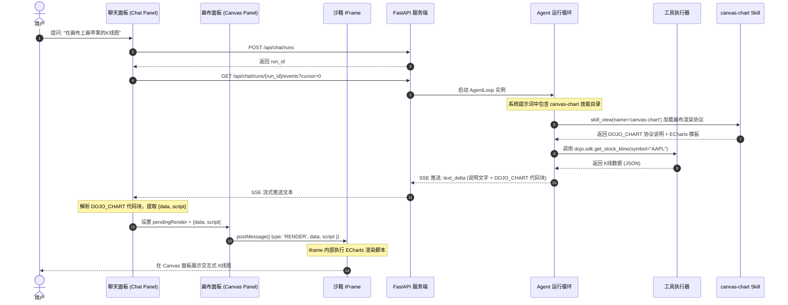
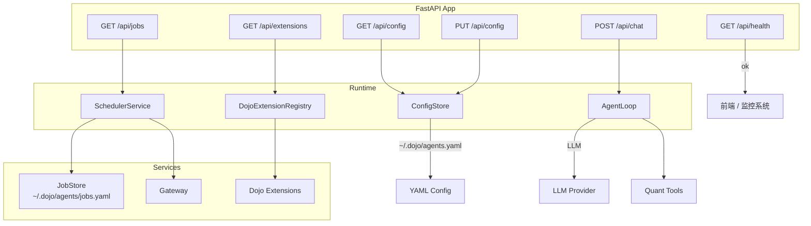
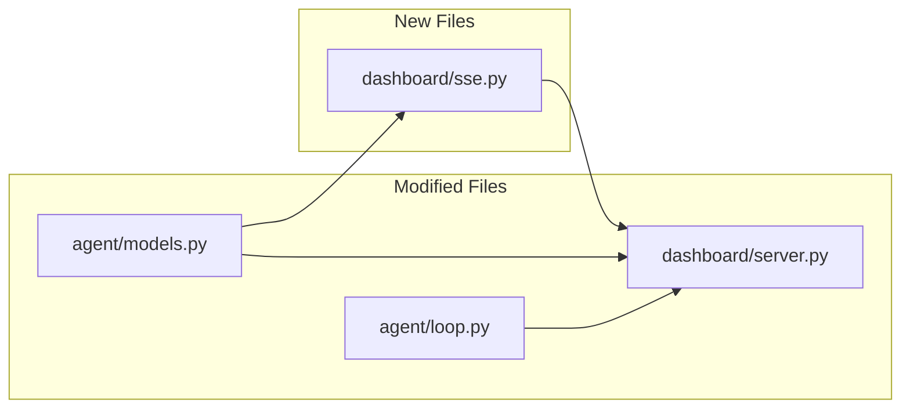
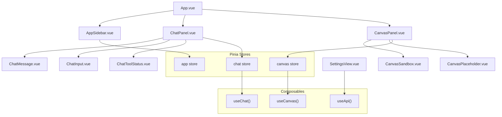
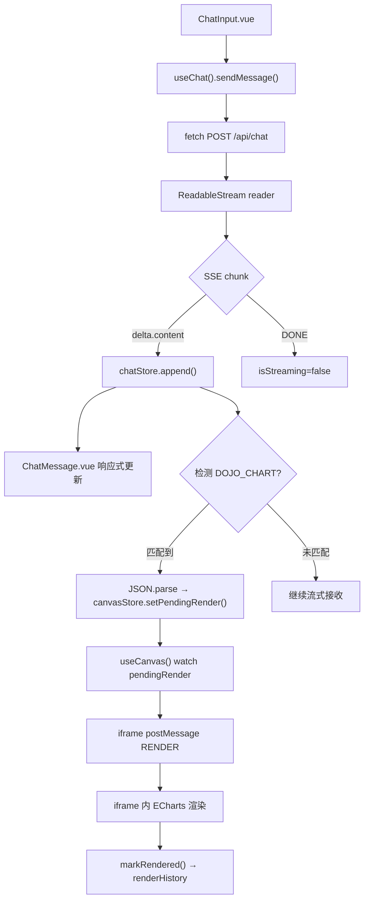
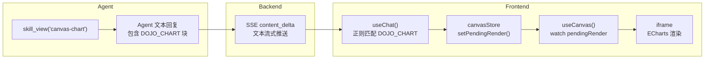

# DojoAgents Dashboard 架构设计规范

本规范定义了 DojoAgents 量化金融分析助手 Dashboard 的整体架构设计、前后端流式接口协议以及前端 Canvas 的安全动态渲染引擎实现。

---

## 1. 整体架构 (Overall Architecture)

DojoAgents Dashboard 采用 **FastAPI 后端** + **静态单页 Web 前端** 架构。系统通过 SSE (Server-Sent Events) 与后台 Agent 运行循环进行交互，允许在 Agent 思考与执行工具的过程中，将数据与执行结果流式推送到前端。自 AlphaDojo6 风格升级后，Dashboard 主 Agent 面板默认走 run-based 传输模型：前端先创建后台 run，再按 cursor 订阅事件流，从而支持刷新恢复和长任务续接。

### 1.1 系统组件拓扑
- **前端页面 (Frontend UI)**：左侧折叠菜单栏、右侧分为主力画布面板 (Canvas Panel) 和 Chatbot 对话框 (Chat Panel)。
- **后端服务端 (FastAPI Server)**：提供 Web 服务与 RESTful API，承载 `/api/chat` 和 `/api/chat/runs/*` 路由，桥接 Agent 运行实例。
- **Agent 运行循环 (Agent Loop)**：驱动 LLM 决策，控制并执行各类工具 (Tools)，并接入 TaskHarness 做任务完成度校验。
- **工具箱 (Quant Tools)**：数据获取工具 (如 `get_kline_data`) 和图表渲染代码生成工具 (如 `generate_chart_code`)。
- **TaskHarness 层**：按任务域修复工具参数、补发评估提示、阻断“看起来完成但实际未验证”的最终答复。

### 1.2 交互时序图

Canvas 画布渲染采用 **Built-in Skill 协议**：Agent 通过 `canvas-chart` 技能学习画布渲染协议，在其文本回复中输出 `DOJO_CHART` 代码块，前端解析后注入 iframe 沙箱渲染。



---

## 2. 页面布局与视觉设计 (Page Layout & UI Design)

系统采用 **Flexible 3-Column Layout (三栏流式布局)**，合理利用宽屏显示器的显示区域，支撑金融数据的可视化需要：

1. **左侧导航栏 (Collapsible Navigation)**
   - 包含："配置设置 (Settings)"、"智能对话 (Chatbot)"、"任务调度 (Scheduler)"。
   - 支持一键收起/展开，收起时仅保留极简图标，为右侧画布腾出最大化空间。
2. **中间画布面板 (Canvas Panel)**
   - 图表与可视化区域。当 Agent 未输出图表时显示等待占位符或系统状态卡片。
   - 当 Agent 输出图表时，左侧/中间的画布将激活并弹出由 Agent 动态生成的交互式 K 线图表、数据报表或回测指标图。
3. **右侧聊天对话框 (Chat Panel)**
   - 交互式的 Chatbot 对话框，与后台 Agent 进行实时的流式文本交互。

---

## 3. 前后端通信协议 (API & SSE Protocol)

`/api/chat` 采用 **OpenAI Chat Completions 兼容协议**，请求与响应默认对齐 OpenAI `/v1/chat/completions` 标准。当 `stream: true` 时，使用 `text/event-stream` (SSE) 格式进行流式推送。从 2026-06 起，Dashboard 主前端在兼容层之上启用 `metadata.event_format = "dojo.v2"` 扩展：流式 chunk 顶层可带 `dojo_event`，非流式 JSON 顶层可带 `dojo`。

### 3.1 SSE 流式事件定义 (`openai.v1` 与 `dojo.v2`)

流式模式下，每个 SSE 事件的 `data` 字段仍然是 OpenAI-compatible JSON chunk。`openai.v1` 只返回标准字段，`dojo.v2` 在标准字段之外增加顶层 `dojo_event`。

| 事件类型 | 触发时机 | chunk `choices[0]` 结构 |
| :--- | :--- | :--- |
| `message_start` | 流开始 | `{"delta": {"role": "assistant", "content": ""}}` |
| `content_delta` | LLM 文本碎片 | `{"delta": {"content": "文本片段"}, "finish_reason": null}` |
| `tool_call_delta` | 工具调用参数流式推送 | `{"delta": {"tool_calls": [{"index": 0, "id": "call_xxx", "function": {"name": "...", "arguments": "..."}}]}, "finish_reason": null}` |
| `message_end` | 生成完成 | `{"delta": {}, "finish_reason": "stop"}` |
| `[DONE]` | 流结束标记 | 无 JSON，直接发送 `data: [DONE]` |

`dojo.v2` 额外事件类型由 `dojo_event.type` 指定：

| `dojo_event.type` | 说明 | 关键字段 |
| :--- | :--- | :--- |
| `phase` | Agent 当前阶段 | `phase: "planning" \| "tools" \| "answering"` |
| `delta` | 文本增量镜像 | `text` |
| `tool_start` | 工具开始执行 | `call_id`, `tool`, `arguments` |
| `tool_result` | 工具完成并返回结构化结果 | `call_id`, `ok`, `content`, `error`, `latency_ms`, `data`, `resource_changes` |
| `retry` | 重试提示 | `attempt`, `max_attempts`, `text` |
| `eval_hint` | 评估提示 | `text`, `issues` |
| `done` | 正常结束 | `model_id`, `tool_trace`, `tool_steps` |
| `error` | 异常结束 | `message`, `code` |

### 3.2 典型通信流示例

**请求**（`POST /api/chat`，`stream: true`）：
```json
{
  "model": "gpt-4.1",
  "messages": [
    {"role": "user", "content": "帮我分析 BTC 并展示K线"}
  ],
  "stream": true,
  "tools": [
    {
      "type": "function",
      "function": {
        "name": "get_kline_data",
        "description": "获取K线数据",
        "parameters": {
          "type": "object",
          "properties": {
            "symbol": {"type": "string"},
            "timeframe": {"type": "string"}
          }
        }
      }
    }
  ],
  "user": "user-001",
  "metadata": {
    "session_id": "session-abc",
    "channel": "dashboard",
    "locale": "zh",
    "event_format": "dojo.v2",
    "quant": {
      "market": "crypto",
      "symbols": ["BTC-USD"],
      "timeframe": "1d"
    }
  }
}
```

**SSE 流式响应**（`dojo.v2` 示例）：
```http
data: {"id":"chatcmpl-dojo-001","object":"chat.completion.chunk","created":1780580000,"model":"gpt-4.1","choices":[{"index":0,"delta":{"role":"assistant","content":""},"finish_reason":null}]}

data: {"id":"chatcmpl-dojo-001","object":"chat.completion.chunk","created":1780580000,"model":"gpt-4.1","choices":[{"index":0,"delta":{},"finish_reason":null}],"dojo_event":{"schema_version":"2.0","run_id":"run-abc","seq":1,"type":"phase","session_id":"session-abc","timestamp":"2026-06-24T10:00:00+00:00","phase":"planning"}}

data: {"id":"chatcmpl-dojo-001","object":"chat.completion.chunk","created":1780580000,"model":"gpt-4.1","choices":[{"index":0,"delta":{"tool_calls":[{"index":0,"id":"call_001","type":"function","function":{"name":"get_kline_data","arguments":"{\"symbol\":\"BTC-USD\",\"timeframe\":\"1d\"}"}}]},"finish_reason":null}],"dojo_event":{"schema_version":"2.0","run_id":"run-abc","seq":2,"type":"tool_start","session_id":"session-abc","timestamp":"2026-06-24T10:00:01+00:00","call_id":"call_001","tool":"get_kline_data","arguments":{"symbol":"BTC-USD","timeframe":"1d"}}}

data: {"id":"chatcmpl-dojo-001","object":"chat.completion.chunk","created":1780580000,"model":"gpt-4.1","choices":[{"index":0,"delta":{},"finish_reason":null}],"dojo_event":{"schema_version":"2.0","run_id":"run-abc","seq":3,"type":"tool_result","session_id":"session-abc","timestamp":"2026-06-24T10:00:02+00:00","call_id":"call_001","tool":"get_kline_data","ok":true,"content":"{...}","error":"","latency_ms":128,"truncated":false,"data":{"series":[...]},"viz_blocks":[],"artifacts":[],"resource_changes":[]}}

data: {"id":"chatcmpl-dojo-001","object":"chat.completion.chunk","created":1780580000,"model":"gpt-4.1","choices":[{"index":0,"delta":{"content":"BTC 当前处于上升趋势..."},"finish_reason":null}],"dojo_event":{"schema_version":"2.0","run_id":"run-abc","seq":4,"type":"delta","session_id":"session-abc","timestamp":"2026-06-24T10:00:03+00:00","text":"BTC 当前处于上升趋势..."}}

data: {"id":"chatcmpl-dojo-001","object":"chat.completion.chunk","created":1780580000,"model":"gpt-4.1","choices":[{"index":0,"delta":{},"finish_reason":"stop"}],"dojo_event":{"schema_version":"2.0","run_id":"run-abc","seq":5,"type":"done","session_id":"session-abc","timestamp":"2026-06-24T10:00:04+00:00","model_id":"gpt-4.1","tool_trace":[{"call_id":"call_001","tool":"get_kline_data","ok":true}],"tool_steps":1}}

data: [DONE]
```

> [!NOTE]
> Agent 内部执行工具后会自动进入下一轮 LLM 调用（agentic loop）。在 `dojo.v2` 中，这个过程不再只表现为文本流，而会以 `phase`、`tool_start`、`tool_result`、`eval_hint`、`done` 等显式事件暴露给前端；标准 OpenAI 客户端则仍可忽略 `dojo_event`，只消费 `choices[0]`。Dashboard 当前由 `AgentRunContext` 管理 `run_id`、`cursor`、停止控制和草稿恢复。

---

## 4. Canvas 画布沙箱渲染引擎 (Canvas Sandboxed Renderer)

为解决 Agent 生成的执行代码带来的潜在 XSS (跨站脚本攻击) 安全隐患，Canvas 画布采用 **IFrame 沙箱隔离机制**，并使用 `postMessage` 传递数据。图表渲染能力封装为 **`canvas-chart` Built-in Skill**，通过 `DOJO_CHART` 协议实现 Agent 与前端画布的通信。

### 4.1 安全沙箱策略 (Security Isolation)
前端使用包含如下属性的 iframe 载入画布：
```html
<iframe 
  id="canvas-iframe" 
  src="/static/canvas-template.html" 
  sandbox="allow-scripts" 
  style="width: 100%; height: 100%; border: none;">
</iframe>
```
> [!IMPORTANT]
> - `sandbox="allow-scripts"` 允许 iframe 执行脚本，但由于**没有**设置 `allow-same-origin`，该 iframe 会被判定为独立的、不同源的上下文。
> - iframe 内部代码无法读取主页面的 Cookie、LocalStorage，亦无法操纵父级 DOM，确保了绝对的安全隔离。

### 4.2 DOJO_CHART 渲染协议

Agent 通过 `canvas-chart` 技能学习画布渲染协议。当需要展示图表时，Agent 在其文本回复中输出一个特殊的 `DOJO_CHART` 代码块，前端解析该代码块并将数据注入 iframe 沙箱。

**协议格式**：
```
```DOJO_CHART
{"data": <图表数据>, "script": "<ECharts 渲染脚本>"}
```
```

**`data` 字段**：图表所需的原始数据（如 K 线 OHLCV 数组、时间序列等），由 Agent 从工具调用结果中提取并格式化。

**`script` 字段**：一段 ECharts JavaScript 函数体，接收 `(chart, data, echarts)` 三个参数，调用 `chart.setOption()` 完成渲染。

**前端解析流程**：
1. `useChat()` 在 SSE 流式接收文本时，实时检测 `DOJO_CHART` 代码块
2. 提取并 JSON.parse 代码块内容，得到 `{ data, script }`
3. 设置 `canvasStore.pendingRender = { data, script }`
4. `useCanvas()` 的 watch 监听触发，通过 `postMessage` 发送到 iframe
5. iframe 内的 ECharts 执行脚本，渲染图表

**当前实现说明**：
- `dojo.v2` 已支持结构化 `tool_result` 与 `resource_changes`，前端可以直接感知工具完成与领域数据刷新
- `DOJO_CHART` 代码块仍保留，用于让模型通过纯文本回复主动驱动画布渲染
- 两者并不冲突：前者解决“过程与结构化状态”，后者解决“模型主动输出可渲染内容”

### 4.3 Iframe 模板实现 (`dojoagents/dashboard/static/canvas-template.html`)
- 预先引入 ECharts 图表渲染引擎（CDN），避免动态加载网络库带来的性能损耗。
- 接收主页面的 `postMessage({ type: 'RENDER', script, data })` 消息。
- 在闭包内执行 Agent 动态生成的绘制代码：`new Function('chart', 'data', 'echarts', script)(chart, data, echarts)`。
- 渲染完成后向父页面发送 `RENDER_COMPLETE` 消息。

---

## 5. 核心工具、Harness 与技能 (Core Tools, Harnesses & Skills)

### 5.0 TaskHarness

TaskHarness 是这次 AlphaDojo6 升级迁入后的关键工程层，用来保证 Agent 的“完成”是真完成，而不是模型只说了一句完成。

当前已接入：

- `PortfolioTaskHarness`
  - 自动补齐后续 portfolio 工具调用里的 `portfolio_id`
  - 对写操作后的最终答复执行完成度校验
  - 若缺少验证性读取，会发出 `eval_hint` 并阻断最终完成

这个机制避免了前端收到“已完成”的文字，但后台其实还没验证落库状态。

Agent 通过 Dojo SDK 工具获取数据，通过 `canvas-chart` Built-in Skill 学习画布渲染协议。

### 5.1 数据获取工具: `dojo.sdk.get_stock_kline` / `dojo.sdk.get_kline`

通过 `dojo_sdk_tool` 提供的量化数据接口，支持股票和加密货币 K 线数据获取。

**`dojo.sdk.get_stock_kline`** — 股票市场数据：
```json
{
  "symbol": { "type": "string", "description": "股票代码，如 AAPL, TSLA" },
  "timeframe": { "type": "string", "description": "周期，如 1d, 1h, 15m" },
  "limit": { "type": "integer", "description": "数据条数", "default": 100 }
}
```

**`dojo.sdk.get_kline`** — 加密货币市场数据：
```json
{
  "symbol": { "type": "string", "description": "交易对，如 BTC-USD, ETH-USD" },
  "timeframe": { "type": "string", "description": "周期，如 1d, 1h, 15m" },
  "limit": { "type": "integer", "description": "数据条数", "default": 100 }
}
```

返回数据格式（JSON）：
```json
{
  "data": [
    {"time": 1700000000, "open": 100.5, "high": 102.3, "low": 99.8, "close": 101.2, "volume": 1500000},
    ...
  ]
}
```

### 5.2 画布渲染技能: `canvas-chart` (Built-in Skill)

`canvas-chart` 是一个内置技能，封装了画布图表渲染的完整能力。Agent 通过 `skill_view(name='canvas-chart')` 懒加载该技能，学习 `DOJO_CHART` 协议和 ECharts 模板。

### 5.3 Web Searcher 工具

为适配 AlphaDojo6 / Hermes 风格的研究链路，Dashboard runtime 现在注册了两个 web 工具：

- `web_search`
  - 只返回标题、URL、描述、位置等搜索结果元数据
  - 适合先搜，再由模型决定是否继续提取正文
- `web_extract`
  - 对公开 URL 做正文提取、清洗和截断压缩
  - 默认拦截私网地址、localhost 和带敏感 query 参数的 URL

这组工具更适合被 Agent 用在“先搜再读”的两段式工作流里，而不是一次性把大量网页正文塞进上下文。

**技能路径**: `dojoagents/skills/built_in/canvas-chart/SKILL.md`

**技能元数据** (frontmatter):
```yaml
---
name: canvas-chart
description: "Canvas chart rendering skill. Teaches the agent to output DOJO_CHART blocks for rendering interactive ECharts visualizations in the Dashboard Canvas panel."
category: visualization
platforms: [dashboard]
---
```

**技能核心内容**：
1. `DOJO_CHART` 协议说明（代码块格式、data/script 字段要求）
2. ECharts 图表模板库：
   - **K 线图 (Candlestick)** — 股票/加密货币行情
   - **折线图 (Line)** — 趋势分析、技术指标
   - **柱状图 (Bar)** — 成交量、对比数据
   - **面积图 (Area)** — 累积收益、区间展示
3. 暗色主题配色方案（与 Dashboard UI 一致）
4. 数据格式化规范（时间戳转换、数值精度）

**Agent 输出示例**：
```
好的，这是苹果公司(AAPL)的K线图：

```DOJO_CHART
{
  "data": [
    {"time": 1700000000, "open": 189.5, "high": 191.2, "low": 188.8, "close": 190.6, "volume": 52000000},
    ...
  ],
  "script": "chart.setOption({\n  title: { text: 'AAPL K-Line' },\n  tooltip: { trigger: 'axis' },\n  xAxis: { data: data.map(d => new Date(d.time*1000).toLocaleDateString()) },\n  yAxis: { scale: true },\n  series: [{ type: 'candlestick', data: data.map(d => [d.open, d.close, d.low, d.high]) }]\n});"
}
```
```

**前端解析逻辑** (`useChat.ts` 中新增 ~10 行):
```typescript
// 在流式文本拼接完成后，检测 DOJO_CHART 代码块
const CHART_RE = /```DOJO_CHART\n([\s\S]*?)\n```/
const match = fullText.match(CHART_RE)
if (match) {
  const payload = JSON.parse(match[1])
  canvasStore.setPendingRender(payload)
}
```

---

## 6. 后端 API 设计 (Backend API Design)

Dashboard 后端基于 **FastAPI** 构建，通过 `create_app(runtime)` 工厂函数创建应用实例，所有 API 路由均挂载在 `/api` 前缀下。后端采用 **Runtime 依赖注入** 模式——`create_app` 接收一个 `runtime` 对象，该对象聚合了 Agent 运行实例、配置存储、调度器和扩展注册表等核心服务。

### 6.1 应用启动与依赖注入

```python
# dojoagents/dashboard/server.py
def create_app(runtime: Any) -> FastAPI:
    app = FastAPI(title="DojoAgents Dashboard")
    # ...注册路由...
    return app
```

`runtime` 对象需暴露以下属性：

| 属性 | 类型 | 说明 |
| :--- | :--- | :--- |
| `runtime.agent` | AgentLoop | Agent 运行循环实例，提供 `.run(request)` 方法 |
| `runtime.config_store` | ConfigStore | 配置存储，提供 `.redacted()` 方法返回脱敏配置 |
| `runtime.scheduler` | SchedulerService | 任务调度服务，提供 `.list_jobs()` 方法 |
| `runtime.extensions` | DojoExtensionRegistry | 扩展注册表，提供 `.status()` 方法 |

### 6.2 Dashboard 配置

Dashboard 服务监听地址通过 `~/.dojo/agents.yaml` 中的 `dashboard` 段配置：

```yaml
dashboard:
  host: "127.0.0.1"
  port: 8765
```

对应数据模型 `DashboardConfig`：

| 字段 | 类型 | 默认值 | 说明 |
| :--- | :--- | :--- | :--- |
| `host` | `str` | `"127.0.0.1"` | 监听地址 |
| `port` | `int` | `8765` | 监听端口 |

### 6.3 REST API 路由一览

#### 6.3.1 `GET /api/health` — 健康检查

轻量级探针接口，用于前端或外部监控系统判断服务是否存活。

- **请求**：无参数
- **响应**：
  ```json
  {"ok": true}
  ```

#### 6.3.2 `GET /api/config` — 获取当前配置（脱敏）

返回当前系统完整配置快照，所有 LLM Provider 的 `api_key` 字段会被替换为 `"***"`，防止敏感信息泄露。

- **请求**：无参数
- **响应**：返回 `AgentsConfig` 的完整 JSON 结构（脱敏后），核心字段如下：

| 字段路径 | 类型 | 说明 |
| :--- | :--- | :--- |
| `llm_provider` | `object` | LLM 提供商配置（default、providers 映射） |
| `llm_provider.providers.<name>.api_key` | `string` | 始终为 `"***"` |
| `agent` | `object` | Agent 配置（model、max_iterations、max_tool_workers 等） |
| `tools.sandbox` | `object` | 沙箱安全配置（allowed_roots、allow_network、timeout 等） |
| `memory` | `object` | 记忆管理配置 |
| `skills` | `object` | 技能目录与加载配置 |
| `scheduler` | `object` | 调度器配置（enabled、timezone、store 路径） |
| `dashboard` | `object` | Dashboard 监听配置 |
| `dojo_extensions` | `object` | 扩展启用列表 |
| `logging` | `object` | 日志级别与格式配置 |
| `mcp_servers` | `object` | MCP Server 连接配置 |
| `dojosdk` | `object` | Dojo SDK 连接配置 |

- **数据来源**：`ConfigStore.redacted()` → 读取 `~/.dojo/agents.yaml` 并与默认值深度合并，支持文件热更新（基于 `st_mtime_ns + st_size` 指纹检测变更自动重载）。

#### 6.3.3 `PUT /api/config` — 更新配置（部分合并）

接收部分配置 JSON，与当前配置深度合并后保存至 `~/.dojo/agents.yaml`。`ConfigStore` 的文件监听器会自动检测变更并在下次请求时热加载新配置。

- **请求 Body**：部分 JSON 对象（仅包含需要修改的字段）
  ```json
  {
    "agent": {
      "max_iterations": 10
    },
    "logging": {
      "level": "DEBUG"
    }
  }
  ```

- **响应**：返回合并后的完整配置（脱敏后），格式同 `GET /api/config`

- **错误响应**：
  | 状态码 | 场景 |
  | :--- | :--- |
  | `422` | 请求体不是合法 JSON 对象 |
  | `503` | `ConfigStore` 不可用（runtime 未注入） |

- **实现**：使用 `ConfigStore.save_raw()` 写入合并后的 YAML，`ConfigStore` 的 `st_mtime_ns + st_size` 指纹机制确保下次 `snapshot()` 自动重载。

#### 6.3.4 `GET /api/jobs` — 获取调度任务列表

返回所有已注册的定时/计划任务。

- **请求**：无参数
- **响应**：`ScheduledJob` 记录数组
  ```json
  [
    {
      "id": "daily-btc-report",
      "name": "每日 BTC 分析报告",
      "schedule": {"hour": 9, "minute": 0},
      "prompt": "分析 BTC 过去24小时行情并生成报告",
      "enabled": true,
      "profile": "default",
      "quant": {
        "market": "crypto",
        "symbols": ["BTC-USD"],
        "timeframe": "1d",
        "currency": "USD",
        "data_freshness": "latest_available"
      },
      "delivery": {"channel": "telegram", "chat_id": "..."},
      "metadata": {}
    }
  ]
  ```

**`ScheduledJob` 数据模型**：

| 字段 | 类型 | 说明 |
| :--- | :--- | :--- |
| `id` | `str` | 任务唯一标识 |
| `name` | `str` | 任务显示名称 |
| `schedule` | `dict` | APScheduler 触发器参数（hour、minute 等） |
| `prompt` | `str` | 发送给 Agent 的提示词 |
| `enabled` | `bool` | 是否启用 |
| `profile` | `str` | Agent 配置 profile，默认 `"default"` |
| `quant` | `QuantContext \| null` | 量化上下文（market、symbols、timeframe 等） |
| `delivery` | `dict \| null` | 结果投递目标（gateway channel 配置） |
| `metadata` | `dict` | 自定义元数据 |

**调度服务 (`SchedulerService`)** 内部通过 `JobStore` 持久化任务定义（YAML 格式，存储于 `~/.dojo/agents/jobs.yaml`），执行时动态创建 Agent Runtime 实例运行任务，运行结果保存为 Markdown 文件并可投递至 Gateway 渠道。

#### 6.3.5 `GET /api/extensions` — 获取扩展状态

返回所有已注册 Dojo Extension 的健康状态。

- **请求**：无参数
- **响应**：
  ```json
  [
    {
      "name": "dojo_research",
      "version": "0.1.0",
      "ok": true,
      "message": "ok"
    }
  ]
  ```

**`DojoExtension` 协议**：每个扩展需实现以下接口：

| 方法 | 返回类型 | 说明 |
| :--- | :--- | :--- |
| `health()` | `ExtensionHealth` | 健康检查（ok + message） |
| `tool_specs()` | `list[ToolSpec]` | 注册到 Agent 的工具定义列表 |
| `execute_command(command)` | `str` | 执行扩展命令 |
| `dashboard_cards()` | `list[DashboardCardSpec]` | Dashboard 卡片定义 |
| `prompt_context(quant_context)` | `str` | 生成注入 Agent 提示词的上下文文本 |

#### 6.3.6 `POST /api/chat` — 对话请求 (OpenAI Chat Completions 兼容)

核心对话接口，采用 **OpenAI `/v1/chat/completions` 兼容协议**。支持 `stream: true` (SSE 流式) 与 `stream: false` (非流式 JSON) 两种模式。默认兼容 OpenAI；当 `metadata.event_format = "dojo.v2"` 时，会在兼容层之上返回 DojoAgents 专用扩展。

- **请求 Body** (OpenAI Chat Completion Request)：
  ```json
  {
    "model": "gpt-4.1",
    "messages": [
      {"role": "system", "content": "You are a helpful assistant."},
      {"role": "user", "content": "帮我分析 BTC 并展示K线"},
      {"role": "assistant", "content": "好的，我来获取数据...", "tool_calls": [
        {"id": "call_001", "type": "function", "function": {"name": "get_kline_data", "arguments": "{\"symbol\":\"BTC-USD\"}"}}
      ]},
      {"role": "tool", "tool_call_id": "call_001", "content": "{\"data\": [...]}"}
    ],
    "stream": true,
    "tools": [
      {
        "type": "function",
        "function": {
          "name": "get_kline_data",
          "description": "获取K线行情数据",
          "parameters": {
            "type": "object",
            "properties": {
              "symbol": {"type": "string", "description": "资产代码，如 BTC-USD"},
              "timeframe": {"type": "string", "description": "周期，如 1d, 1h"},
              "limit": {"type": "integer", "description": "数据条数", "default": 100}
            },
            "required": ["symbol"]
          }
        }
      }
    ],
    "tool_choice": "auto",
    "temperature": 0.7,
    "user": "user-001",
    "metadata": {
      "session_id": "session-abc",
      "channel": "dashboard",
      "locale": "zh",
      "event_format": "dojo.v2",
      "quant": {
        "market": "crypto",
        "symbols": ["BTC-USD"],
        "timeframe": "1d",
        "currency": "USD",
        "data_freshness": "latest_available"
      }
    }
  }
  ```

| 字段 | 类型 | 必填 | 默认值 | 说明 |
| :--- | :--- | :--- | :--- | :--- |
| `model` | `string` | 是 | — | 模型 ID（如 `gpt-4.1`、`deepseek-chat`） |
| `messages` | `list[Message]` | 是 | — | 对话消息列表，格式对齐 OpenAI（支持 `system`/`user`/`assistant`/`tool` 角色） |
| `stream` | `boolean` | 否 | `false` | 是否启用 SSE 流式响应 |
| `tools` | `list[Tool]` | 否 | `null` | 工具定义列表，格式对齐 OpenAI function calling |
| `tool_choice` | `string \| object` | 否 | `"auto"` | 工具选择策略（`auto`/`none`/`required`/指定工具） |
| `temperature` | `number` | 否 | `1.0` | 采样温度 |
| `user` | `string` | 否 | — | 用户标识，用于追踪 |
| `metadata` | `object` | 否 | `{}` | **DojoAgents 扩展字段**，携带 Agent 运行所需的额外上下文 |

**`metadata` 扩展字段**（DojoAgents 特有，非 OpenAI 标准字段）：

| 字段 | 类型 | 必填 | 默认值 | 说明 |
| :--- | :--- | :--- | :--- | :--- |
| `session_id` | `string` | 否 | 自动生成 | 会话 ID，用于 Agent 上下文关联与记忆检索 |
| `channel` | `string` | 否 | `"dashboard"` | 消息来源渠道 |
| `locale` | `string` | 否 | `"zh"` | Agent 回答与占位文案的目标语言 |
| `event_format` | `string` | 否 | `"openai.v1"` | 返回格式协商；Dashboard React 主前端应设置为 `"dojo.v2"` |
| `quant` | `QuantContext \| null` | 否 | `null` | 量化分析上下文（market、symbols、timeframe 等） |

- **非流式响应** (`stream: false`)：返回完整 JSON，格式对齐 OpenAI Chat Completion Response：
  ```json
  {
    "id": "chatcmpl-dojo-001",
    "object": "chat.completion",
    "created": 1780580000,
    "model": "gpt-4.1",
    "choices": [
      {
        "index": 0,
        "message": {
          "role": "assistant",
          "content": "BTC 当前处于上升趋势，过去24小时涨幅 2.3%..."
        },
        "finish_reason": "stop"
      }
    ],
    "usage": {
      "prompt_tokens": 350,
      "completion_tokens": 120,
      "total_tokens": 470
    },
    "dojo": {
      "schema_version": "2.0",
      "run_id": "run-abc",
      "events": [
        {"type": "phase", "phase": "planning"},
        {"type": "tool_start", "call_id": "call_001", "tool": "get_kline_data"},
        {"type": "tool_result", "call_id": "call_001", "ok": true},
        {"type": "done", "tool_steps": 1}
      ]
    },
    "content": "BTC 当前处于上升趋势，过去24小时涨幅 2.3%...",
    "session_id": "session-abc"
  }
  ```

  说明：

  - `dojo` 仅在 `metadata.event_format = "dojo.v2"` 时出现
  - `content` 与 `session_id` 为兼容旧客户端保留的扩展字段
  - `dojo.events` 是同一轮 Agent 运行的完整 typed event 记录，便于调试、回放与非流式 UI

- **流式响应** (`stream: true`)：返回 `text/event-stream`，每个 chunk 格式对齐 OpenAI streaming：
  ```http
  data: {"id":"chatcmpl-dojo-001","object":"chat.completion.chunk","created":1780580000,"model":"gpt-4.1","choices":[{"index":0,"delta":{"role":"assistant","content":""},"finish_reason":null}]}

  data: {"id":"chatcmpl-dojo-001","object":"chat.completion.chunk","created":1780580000,"model":"gpt-4.1","choices":[{"index":0,"delta":{"content":"BTC 当前处于上升趋势..."},"finish_reason":null}]}

  data: {"id":"chatcmpl-dojo-001","object":"chat.completion.chunk","created":1780580000,"model":"gpt-4.1","choices":[{"index":0,"delta":{},"finish_reason":"stop"}]}

  data: [DONE]
  ```

| 字段 | 类型 | 说明 |
| :--- | :--- | :--- |
| `id` | `string` | 补全 ID（格式 `chatcmpl-dojo-<uuid>`） |
| `object` | `string` | 非流式 `"chat.completion"`，流式 `"chat.completion.chunk"` |
| `created` | `integer` | Unix 时间戳 |
| `model` | `string` | 实际使用的模型 ID |
| `choices` | `list` | 结果列表（当前始终返回 1 个） |
| `choices[0].message` | `object` | 非流式：完整消息（含 `role`、`content`、可选 `tool_calls`） |
| `choices[0].delta` | `object` | 流式：增量内容（含 `content`、可选 `tool_calls`） |
| `choices[0].finish_reason` | `string \| null` | `"stop"` (完成) / `null` (流进行中) |
| `usage` | `object` | 非流式：token 用量统计（仅非流式模式返回） |
| `dojo` | `object \| null` | 非流式 `dojo.v2` 扩展，包含 `schema_version`、`run_id` 与完整 `events` |
| `dojo_event` | `object \| null` | 流式 `dojo.v2` 扩展，挂在每个 chunk 顶层 |

> [!IMPORTANT]
> **兼容策略**：
> - 未设置 `metadata.event_format` 时，后端保持 `openai.v1` 行为
> - 旧客户端仍可只消费 OpenAI `choices[0]`
> - Dashboard React 主前端应显式设置 `metadata.event_format = "dojo.v2"`，并消费 `dojo_event`
> - `metadata.history` 不再是新客户端的必需字段；后端会从标准 `messages` 自动构造历史

**`QuantContext` 数据模型**（量化上下文，通过 `metadata.quant` 传递，贯穿 chat/jobs/extensions）：

| 字段 | 类型 | 默认值 | 说明 |
| :--- | :--- | :--- | :--- |
| `market` | `"stock" \| "crypto"` | — | 市场类型 |
| `symbols` | `list[str]` | — | 资产代码列表 |
| `timeframe` | `str` | — | 时间周期（如 `1d`、`1h`、`15m`） |
| `currency` | `str` | `"USD"` | 计价货币 |
| `data_freshness` | `str` | `"latest_available"` | 数据新鲜度要求 |

### 6.4 序列化与数据安全

后端使用 `_jsonable()` 辅助函数统一处理响应序列化，自动将 Python `dataclass` 实例递归转换为 JSON 可序列化结构：

```python
def _jsonable(value: Any) -> Any:
    if is_dataclass(value):   # dataclass → dict
        return asdict(value)
    if isinstance(value, list):
        return [_jsonable(item) for item in value]
    if isinstance(value, dict):
        return {key: _jsonable(item) for key, item in value.items()}
    return value
```

**安全策略**：
- `/api/config` 接口通过 `ConfigStore.redacted()` 对所有 LLM Provider 的 `api_key` 字段进行脱敏处理，确保前端无法获取真实密钥。
- Dashboard 默认监听 `127.0.0.1`（仅本地访问），生产环境需配合反向代理（Nginx/Caddy）实现 TLS 与鉴权。

### 6.5 后端服务架构图



---

## 7. 实现计划 (Implementation Plan)

本节梳理了将设计文档中的 OpenAI Chat Completions 协议落地到代码所需的全部变更，分为 **后端新增/优化** 与 **前端 Vue 3 实现方案** 两部分，并标注每项任务对应的代码路径。

### 7.1 后端变更清单 (Backend Changes)

#### 7.1.1 新增：OpenAI 协议适配层

| 任务 | 文件路径 | 说明 |
| :--- | :--- | :--- |
| 新增 OpenAI 请求模型 | `dojoagents/agent/models.py` | 新增 `ChatCompletionRequest` dataclass，字段对齐 OpenAI：`model`、`messages`、`stream`、`tools`、`tool_choice`、`temperature`、`user`、`metadata` |
| 新增 OpenAI 响应构建器 | `dojoagents/agent/models.py` | 新增 `ChatCompletionResponse` 及 `ChatCompletionChunk` dataclass，提供 `from_agent_response()` 工厂方法将内部 `AgentResponse` 转换为 OpenAI 格式 |
| 新增 SSE 流式生成器 | `dojoagents/dashboard/sse.py` | 提供 `stream_completion_chunks()` 与请求级 `AgentEventSink` 适配，将 typed event 序列编码为 OpenAI chunk，并在 `dojo.v2` 模式下注入 `dojo_event` |

#### 7.1.2 优化：`/api/chat` 路由

| 任务 | 文件路径 | 说明 |
| :--- | :--- | :--- |
| 重写请求解析逻辑 | `dojoagents/dashboard/server.py` | `_completion_request()` 解析 OpenAI `messages`，清理空 user 消息，自动构造 `history`，并从 `metadata` 读取 `session_id` / `channel` / `locale` / `event_format` / `quant` |
| 新增 SSE 流式响应分支 | `dojoagents/dashboard/server.py` | `chat()` 根据 `stream` 分支，并在 `dojo.v2` 下创建请求级 `AgentEventSink`；非流式时把事件序列收集到 `dojo.events` |
| 新增 CORS 中间件 | `dojoagents/dashboard/server.py` | 在 `create_app()` 中注册 `CORSMiddleware`，允许前端开发服务器跨域 |

#### 7.1.3 优化：AgentLoop 适配

| 任务 | 文件路径 | 说明 |
| :--- | :--- | :--- |
| 确认 messages 历史兼容性 | `dojoagents/agent/loop.py` | 确认 OpenAI `messages` 格式（含 `tool_calls`、`tool` 角色）与现有 `strands_to_dojo_messages()` 转换逻辑的兼容性 |
| 请求级事件流 | `dojoagents/agent/loop.py` | `AgentLoop.run(request, event_sink=...)` 支持请求级 typed event，下游不再通过共享 `stream_delta_callback` 进行路由层注入 |
| Token 用量统计 | `dojoagents/agent/loop.py` | 在 `AgentResponse.metadata` 中填充 `usage` 信息（`prompt_tokens`、`completion_tokens`、`total_tokens`） |

#### 7.1.4 变更影响范围图



### 7.2 前端实现方案 — Vue 3 SPA (Frontend Implementation)

前端采用 **Vue 3 + TypeScript + Vite** 构建单页应用，构建产物输出至 `dojoagents/dashboard/static/` 由 FastAPI 直接服务。

#### 7.2.1 技术栈选型

| 技术 | 版本 | 用途 |
| :--- | :--- | :--- |
| Vue 3 | ^3.5 | 响应式 UI 框架（Composition API + `<script setup>`） |
| TypeScript | ^5.5 | 类型安全，对齐 OpenAI 协议类型定义 |
| Vite | ^6.0 | 构建工具，开发时 HMR + 生产构建 |
| Pinia | ^3.0 | 全局状态管理（Chat 历史、Canvas 数据、配置） |
| Vue Router | ^4.0 | 导航路由（Chatbot / Settings / Scheduler 视图切换） |
| @vueuse/core | ^12.0 | 实用 Composables（`useFetch`、`useEventListener`、`useStorage`） |
| markdown-it | ^14.0 | Agent 回复的 Markdown 渲染 |
| ECharts | ^5.5 | Canvas iframe 内图表渲染引擎（iframe 内部依赖） |

#### 7.2.2 项目目录结构

```
dojoagents/dashboard/frontend/          # Vue 3 源码根目录
├── index.html                          # Vite 入口 HTML
├── vite.config.ts                      # Vite 配置（输出至 static/）
├── tsconfig.json
├── package.json
├── src/
│   ├── main.ts                         # Vue app 创建 & 插件注册
│   ├── App.vue                         # 根组件（三栏布局骨架）
│   ├── components/
│   │   ├── layout/
│   │   │   ├── AppSidebar.vue          # 左侧可折叠导航栏
│   │   │   └── AppLayout.vue           # 三栏布局容器
│   │   ├── chat/
│   │   │   ├── ChatPanel.vue           # 聊天面板主容器
│   │   │   ├── ChatMessage.vue         # 单条消息气泡（支持 Markdown）
│   │   │   ├── ChatInput.vue           # 输入框 + 发送按钮
│   │   │   └── ChatToolStatus.vue      # 工具调用状态指示器
│   │   ├── canvas/
│   │   │   ├── CanvasPanel.vue         # Canvas 面板主容器
│   │   │   ├── CanvasSandbox.vue       # iframe 沙箱组件（封装 postMessage）
│   │   │   └── CanvasPlaceholder.vue   # 无图表时的占位符
│   │   ├── settings/
│   │   │   └── SettingsView.vue        # 配置编辑表单（GET/PUT /api/config，9 个可折叠分区）
│   │   └── scheduler/
│   │       └── SchedulerView.vue       # 任务调度页面（GET /api/jobs）
│   ├── composables/
│   │   ├── useChat.ts                  # 核心：OpenAI SSE 流式对话逻辑
│   │   ├── useCanvas.ts                # Canvas 数据提取与 iframe 通信
│   │   ├── useApi.ts                   # REST API 请求封装
│   │   └── useSession.ts               # 会话管理（session_id、历史持久化）
│   ├── stores/
│   │   ├── chat.ts                     # Pinia：消息历史、流式状态、会话 ID
│   │   ├── canvas.ts                   # Pinia：图表数据、渲染脚本、iframe 状态
│   │   └── app.ts                      # Pinia：全局 UI 状态（侧栏折叠、当前路由）
│   ├── types/
│   │   ├── openai.ts                   # OpenAI 协议类型定义
│   │   ├── api.ts                      # 后端 API 响应类型
│   │   └── quant.ts                    # QuantContext 等量化类型
│   └── utils/
│       ├── sse-parser.ts               # SSE 流解析器（fetch + ReadableStream）
│       └── markdown.ts                 # markdown-it 配置与插件
│
dojoagents/dashboard/static/            # Vite 构建产物输出目录
├── index.html                          # 构建后的入口页面
├── assets/                             # JS/CSS 资源
└── canvas-template.html                # iframe 沙箱模板（独立于 Vue 构建）
```

#### 7.2.3 组件层级与数据流



#### 7.2.4 核心类型定义 (`src/types/openai.ts`)

```typescript
export interface ChatCompletionRequest {
  model: string
  messages: ChatMessage[]
  stream?: boolean
  tools?: ToolDefinition[]
  tool_choice?: 'auto' | 'none' | 'required' | object
  temperature?: number
  user?: string
  metadata?: Record<string, unknown>
}

export interface ChatMessage {
  role: 'system' | 'user' | 'assistant' | 'tool'
  content: string | null
  tool_calls?: ToolCall[]
  tool_call_id?: string
}

export interface ToolCall {
  id: string
  type: 'function'
  function: { name: string; arguments: string }
}

export interface ChatCompletionChunk {
  id: string
  object: 'chat.completion.chunk'
  created: number
  model: string
  choices: ChunkChoice[]
}

interface ChunkChoice {
  index: number
  delta: { role?: string; content?: string; tool_calls?: ToolCall[] }
  finish_reason: 'stop' | 'tool_calls' | null
}
```

#### 7.2.5 核心 Composable: `useChat()`

`useChat()` 负责 SSE 流式对话，同时检测 `DOJO_CHART` 代码块并触发画布渲染。

```typescript
// src/composables/useChat.ts
const CHART_RE = /```DOJO_CHART\n([\s\S]*?)\n```/

export function useChat() {
  const chatStore = useChatStore()
  const canvasStore = useCanvasStore()
  const isStreaming = ref(false)

  async function sendMessage(userInput: string) {
    chatStore.addMessage({ role: 'user', content: userInput })
    isStreaming.value = true

    const request: ChatCompletionRequest = {
      model: 'gpt-4.1',
      messages: chatStore.messages,
      stream: true,
      metadata: { session_id: chatStore.sessionId, channel: 'dashboard' },
    }

    const response = await fetch('/api/chat', {
      method: 'POST',
      headers: { 'Content-Type': 'application/json' },
      body: JSON.stringify(request),
    })

    chatStore.addMessage({ role: 'assistant', content: '' })

    const reader = response.body!.getReader()
    const decoder = new TextDecoder()
    let buffer = ''

    while (true) {
      const { done, value } = await reader.read()
      if (done) break
      buffer += decoder.decode(value, { stream: true })
      const lines = buffer.split('\n')
      buffer = lines.pop() || ''

      for (const line of lines) {
        if (!line.startsWith('data: ')) continue
        const data = line.slice(6).trim()
        if (data === '[DONE]') { isStreaming.value = false; return }

        const chunk: ChatCompletionChunk = JSON.parse(data)
        const delta = chunk.choices[0]?.delta

        if (delta?.content) {
          chatStore.appendToLastAssistant(delta.content)
          // 检测 DOJO_CHART 代码块 → 触发画布渲染
          const fullText = chatStore.lastAssistantContent
          const match = fullText.match(CHART_RE)
          if (match) {
            try {
              const payload = JSON.parse(match[1])
              canvasStore.setPendingRender(payload)
            } catch { /* 等待完整 JSON */ }
          }
        }
      }
    }
  }

  return { sendMessage, isStreaming }
}
```

#### 7.2.6 核心 Composable: `useCanvas()`

```typescript
// src/composables/useCanvas.ts
export function useCanvas() {
  const canvasStore = useCanvasStore()
  const iframeRef = ref<HTMLIFrameElement | null>(null)

  watch(
    () => canvasStore.pendingRender,
    (payload) => {
      if (payload && iframeRef.value?.contentWindow) {
        iframeRef.value.contentWindow.postMessage({
          type: 'RENDER',
          script: payload.script,
          data: payload.data,
        }, '*')
        canvasStore.markRendered()
      }
    }
  )

  return { iframeRef }
}
```

#### 7.2.7 Pinia Store 设计

**`stores/chat.ts`** — 对话状态：

```typescript
export const useChatStore = defineStore('chat', () => {
  const messages = ref<ChatMessage[]>([])
  const sessionId = ref(crypto.randomUUID())
  const isStreaming = ref(false)

  function addMessage(msg: ChatMessage) { messages.value.push(msg) }
  function appendToLastAssistant(text: string) {
    const last = messages.value[messages.value.length - 1]
    if (last?.role === 'assistant') last.content += text
  }
  function clearHistory() {
    messages.value = []
    sessionId.value = crypto.randomUUID()
  }

  return { messages, sessionId, isStreaming, addMessage, appendToLastAssistant, clearHistory }
})
```

**`stores/canvas.ts`** — Canvas 渲染状态：

```typescript
export const useCanvasStore = defineStore('canvas', () => {
  const pendingRender = ref<{ data: unknown; script: string } | null>(null)
  const renderHistory = ref<Array<{ data: unknown; script: string; timestamp: number }>>([])

  // 由 useChat() 的 DOJO_CHART 解析器调用
  function setPendingRender(payload: { data: unknown; script: string }) {
    pendingRender.value = payload
  }
  // 由 useCanvas() 的 watch 调用，渲染完成后调用
  function markRendered() {
    if (pendingRender.value) {
      renderHistory.value.push({ ...pendingRender.value, timestamp: Date.now() })
      pendingRender.value = null
    }
  }
  function clearCanvas() { pendingRender.value = null }

  return { pendingRender, renderHistory, setPendingRender, markRendered, clearCanvas }
})
```

#### 7.2.8 Vite 构建配置

```typescript
// vite.config.ts
import { defineConfig } from 'vite'
import vue from '@vitejs/plugin-vue'

export default defineConfig({
  plugins: [vue()],
  build: {
    outDir: '../static',    // 输出至 dojoagents/dashboard/static/
    emptyOutDir: true,
  },
  server: {
    proxy: {
      '/api': 'http://127.0.0.1:8765',  // 开发时代理后端
    },
  },
})
```

#### 7.2.9 前端 SSE 解析与画布渲染流程



#### 7.2.10 前端关键设计决策

| 决策点 | 选择 | 理由 |
| :--- | :--- | :--- |
| SSE 客户端 | `fetch()` + `ReadableStream` | `EventSource` 不支持 `POST`，无法发送 OpenAI 协议请求体 |
| 状态管理 | Pinia (Composition API) | 轻量、TS 友好、支持 `setup()` 语法 |
| Canvas 沙箱 | 独立 iframe + `postMessage` | 安全隔离 Agent JS 代码，与 Vue 组件树解耦 |
| 构建产物 | Vite 输出至 `static/` | FastAPI 直接服务静态文件，无需额外 Web Server |
| 消息历史 | Pinia + `localStorage` 持久化 | 刷新后保留对话，对齐 OpenAI `messages` 协议 |
| 路由 | Vue Router（hash 模式） | Settings/Chatbot/Scheduler 视图切换，hash 模式兼容静态文件服务 |

### 7.3 实现状态追踪 (Implementation Status)

#### 已完成 (Completed)

| 功能 | 涉及文件 | 说明 |
| :--- | :--- | :--- |
| `/api/chat` OpenAI 协议 | `server.py`, `models.py` | OpenAI Chat Completions 兼容协议，流式 + 非流式 |
| SSE 流式推送 | `sse.py`, `server.py` | `stream_completion_chunks()` + `make_event_queue_sink()` |
| AgentLoop 适配 | `loop.py` | `stream_delta_callback` 参数，Strands → OpenAI 格式转换 |
| Vue 3 SPA 项目 | `frontend/` | Vite + Vue 3 + TS + Pinia + Vue Router |
| 前端组件 | `frontend/src/components/` | AppLayout, ChatPanel, CanvasPanel, SettingsView, SchedulerView |
| Composables | `frontend/src/composables/` | useChat, useCanvas, useApi, useSession |
| Pinia Stores | `frontend/src/stores/` | chat, canvas, app |
| 集成测试 | `tests/test_dashboard_*.py` | 162+ 测试用例全部通过 |
| `PUT /api/config` | `server.py` | 部分合并 + 热加载 + 表单编辑 |
| Settings 表单 | `SettingsView.vue` | 9 个可折叠分区的表单编辑界面 |
| 静态文件服务 | `server.py` | FastAPI 直接服务构建产物 |

#### 待实现 (Pending)

| 优先级 | 功能 | 涉及文件 | 说明 |
| :--- | :--- | :--- | :--- |
| **P0** | `canvas-chart` Built-in Skill | `skills/built_in/canvas-chart/SKILL.md` (new) | DOJO_CHART 协议 + ECharts 模板库（K线/折线/柱状/面积） |
| **P0** | `useChat` DOJO_CHART 解析 | `frontend/src/composables/useChat.ts` | 正则检测 DOJO_CHART 代码块 → canvasStore.setPendingRender() |
| **P0** | Canvas Store 重构 | `frontend/src/stores/canvas.ts` | 移除 toolCallBuffers，改为 setPendingRender() API |
| P1 | `useCanvas` watch 适配 | `frontend/src/composables/useCanvas.ts` | 适配新的 pendingRender 触发方式 |
| P1 | Canvas 沙箱模板更新 | `static/canvas-template.html` | 确保 `new Function('chart', 'data', 'echarts', script)` 执行正确 |
| P2 | Token 用量统计 | `loop.py`, `models.py` | AgentResponse.metadata 填充 usage |
| P2 | 会话持久化 | `stores/chat.ts`, `server.py` | localStorage + /api/sessions |
| P3 | 前端断线重连 | `composables/useChat.ts` | SSE 流中断后自动重试 |


---

## 8. Canvas Chart Skill 架构设计 (Canvas Chart Skill Architecture)

本节详述 `canvas-chart` Built-in Skill 的完整架构设计，作为实现画布渲染能力的核心方案。

### 8.1 设计动机

早期设计（第 1.2 节时序图）假设 SSE 流会推送 `tool_result` 事件，前端可拦截工具输出。该假设现已在 `dojo.v2` 中落地，下面保留的是历史问题与当前结论：

| 层级 | 问题 | 根因 |
| :--- | :--- | :--- |
| SSE 管线 | 已支持 typed event 与结构化工具结果 | `dojo_event` 暴露 `phase`、`tool_start`、`tool_result`、`done` |
| 前端 Agent 面板 | 已消费 typed event | React 主前端可展示阶段、工具状态与资源刷新 |
| Agent 提示词 | 仍需知道画布渲染协议 | `DOJO_CHART` 仍由 skill / prompt 协议驱动 |

**当前结论**：`dojo.v2` 负责 Agent 过程与结构化状态，`DOJO_CHART` 负责模型驱动的画布渲染，两者共同构成当前 Dashboard Agent 体验。

### 8.2 Skill 文件结构

```
dojoagents/skills/built_in/canvas-chart/
├── SKILL.md                    # 技能定义（frontmatter + 协议说明 + 模板库）
└── assets/
    └── canvas-template.html    # iframe 沙箱模板副本（供参考）
```

### 8.3 SKILL.md 内容设计

```markdown
---
name: canvas-chart
description: "Canvas chart rendering skill. Teaches the agent to output DOJO_CHART blocks for rendering interactive ECharts visualizations in the Dashboard Canvas panel."
category: visualization
platforms: [dashboard]
---

# Canvas Chart Rendering

When the user requests a chart or visualization on the canvas, you MUST output a DOJO_CHART code block in your response.

## Protocol

Output a fenced code block with language tag DOJO_CHART containing a JSON object:

\`\`\`DOJO_CHART
{"data": <chart_data>, "script": "<echarts_script>"}
\`\`\`

### Fields

- **data**: The chart data array. For K-line charts, each element: {time, open, high, low, close, volume}
- **script**: A JavaScript function body that receives (chart, data, echarts) parameters. Call chart.setOption() to render.

## Chart Templates

### K-Line (Candlestick)
[模板代码...]

### Line Chart
[模板代码...]

### Bar Chart
[模板代码...]

### Area Chart
[模板代码...]
```

### 8.4 端到端数据流



### 8.5 扩展性

新增图表类型只需更新 `SKILL.md` 中的模板库，无需修改任何代码：
- **饼图 (Pie)** — 占比分析
- **热力图 (Heatmap)** — 相关性矩阵
- **布林带 (Bollinger Bands)** — 技术指标叠加
- **多图表组合** — 主图 + 副图（成交量）
