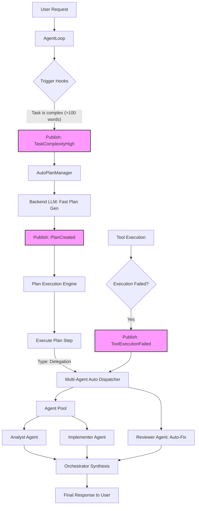

# Event-Driven Multi-Agent & Planning Architecture

## 1. Context & Goal

Currently, DojoAgents operates primarily via **Prompt-Driven Tool Calling**. When complexity is detected, the system injects prompts (e.g., `PLAN_PROMPT`, `ORCHESTRATION_PROMPT`) hoping the main LLM will manually invoke tools like `create_plan` or `delegate_task`.

**Goal**: To implement an **Event-Driven Orchestration** paradigm. Instead of relying on the main LLM to orchestrate itself via tools, the framework will intercept key events (high complexity, tool failures, large data payloads) and automatically trigger plan generation, step execution, and sub-agent dispatch in the background.

---

## 2. Overall Architecture Design Diagram

The following diagram illustrates how events flow through the system to automatically trigger planning and multi-agent coordination without manual LLM tool invocation.



---

## 3. Core Foundation: Event Bus

To decouple triggers from execution, we introduce a lightweight `EventBus`.

**Key Events:**
- `TaskComplexityHigh`: Triggered on complex user input.
- `ToolExecutionFailed`: Triggered when a tool (e.g., code executor) errors out.
- `DataVolumeLarge`: Triggered when a tool returns massive data.

### Code Sample: Event Bus
```python
from typing import Callable, Any

class EventBus:
    def __init__(self):
        self.subscribers = {}

    def subscribe(self, event_type: str, handler: Callable):
        self.subscribers.setdefault(event_type, []).append(handler)

    async def publish(self, event_type: str, payload: dict[str, Any]):
        for handler in self.subscribers.get(event_type, []):
            await handler(payload)

event_bus = EventBus()
```

---

## 4. Planning Architecture (Auto-Plan)

Instead of passing the `create_plan` tool to the LLM, the `AutoPlanManager` handles it in the background.

**Workflow**:
1. `PlanActivationHook` evaluates the request. If complex, it publishes `TaskComplexityHigh`.
2. `AutoPlanManager` intercepts the event and uses a structured output LLM call to generate a `Plan` DAG.
3. `PlanExecutionEngine` listens to `PlanCreated` and automatically steps through the plan.

### Code Sample: Auto-Plan Manager
```python
# dojoagents/planning/automation.py
from dojoagents.planning.models import Plan
from dojoagents.planning.engine import PlanExecutionEngine

class AutoPlanManager:
    def __init__(self, llm_provider, plan_engine: PlanExecutionEngine):
        self.llm = llm_provider
        self.engine = plan_engine
        event_bus.subscribe("TaskComplexityHigh", self.handle_complex_task)

    async def handle_complex_task(self, payload: dict):
        user_message = payload["request"].message
        session_id = payload["request"].session_id
        
        # 1. Automatically generate the plan via backend LLM
        plan_json = await self.llm.structured_output(
            prompt=f"Create an execution plan for: {user_message}",
            schema=Plan
        )
        plan = Plan.parse_obj(plan_json)
        
        # 2. Automatically execute the plan
        completed_plan = await self.engine.execute_plan(plan, session_id)
        
        # 3. Publish completion
        await event_bus.publish("PlanCompleted", {"plan": completed_plan})
```

---

## 5. Multi-Agent Architecture (Auto-Delegation)

Instead of the orchestrator LLM deciding to call `delegate_task`, the system maps specific events or plan steps to specialized sub-agents.

**Workflow**:
1. **Agent Pool**: Maintains specialized instances of `AgentLoop` (e.g., `analyst`, `reviewer`).
2. **Auto-Routing**:
   - `ToolExecutionFailed` -> Routes the error and context to the **ReviewerAgent** to debug.
   - `PlanStep(type=DELEGATION)` -> Routes to the **AnalystAgent** or **ImplementerAgent** based on the task.

### Code Sample: Multi-Agent Auto-Dispatcher
```python
# dojoagents/multi_agent/automation.py
class MultiAgentAutoDispatcher:
    def __init__(self, agent_pool):
        self.pool = agent_pool
        event_bus.subscribe("ToolExecutionFailed", self.handle_tool_failure)
        event_bus.subscribe("DataVolumeLarge", self.handle_large_data)

    async def handle_tool_failure(self, payload: dict):
        """Automatically spawn a Reviewer agent when code execution fails."""
        failed_code = payload["tool_args"].get("code")
        error_msg = payload["error"]
        
        reviewer = self.pool.get_agent("reviewer")
        fix_request = ChatRequest(
            message=f"The following code failed with error:\n{error_msg}\n\nCode:\n{failed_code}\nPlease fix it.",
            channel="internal",
            session_id=payload["session_id"]
        )
        
        # Auto-execute reviewer agent
        response = await reviewer.run(fix_request)
        await event_bus.publish("ToolErrorFixed", {"fixed_code": response.content})

    async def handle_large_data(self, payload: dict):
        """Automatically spawn an Analyst agent when large data is returned."""
        analyst = self.pool.get_agent("analyst")
        response = await analyst.run(ChatRequest(
            message=f"Analyze this large dataset: {payload['data_summary']}",
            channel="internal",
            session_id=payload["session_id"]
        ))
        await event_bus.publish("AnalysisCompleted", {"analysis": response.content})
```
