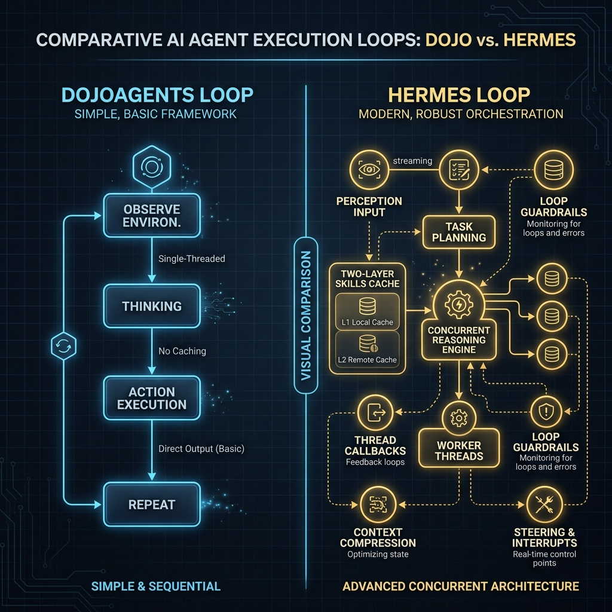
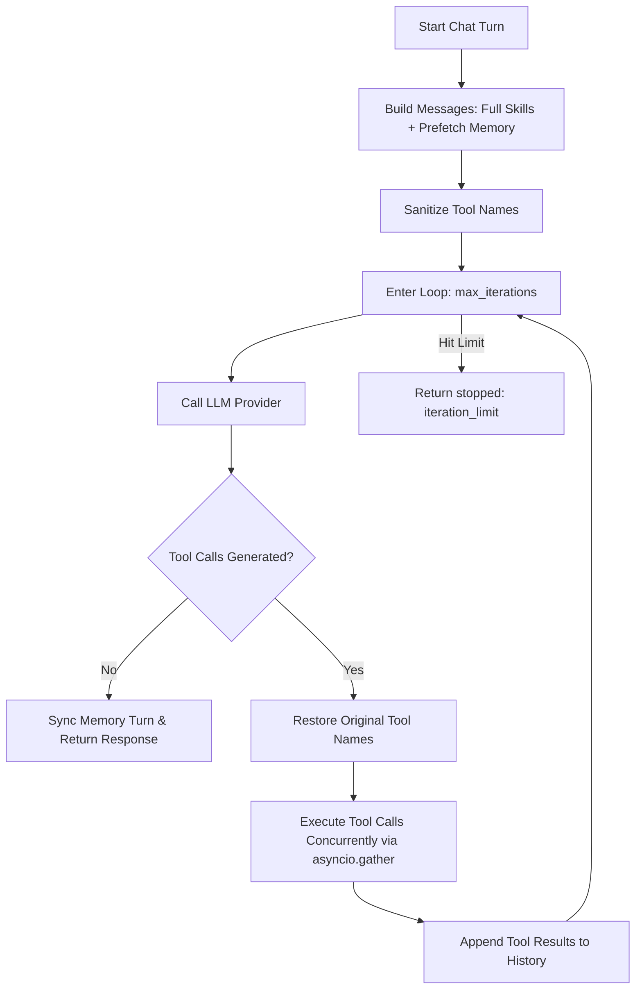
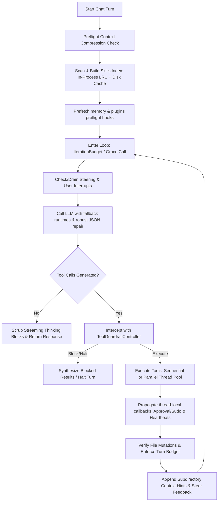

# DojoAgents vs Hermes-Agent: `agent` Module Architectural Gap Analysis

This document presents a detailed comparative analysis between the agent orchestration layer in **Hermes-Agent** (`hermes-agent/agent/`) and **DojoAgents** (`dojoagents/agent/`). It identifies functional gaps, outlines structural differences, and details how DojoAgents can evolve to match the performance, safety, and scalability of Hermes.

---

## 1. High-Level Architectural Comparison

At a high level, DojoAgents implements a basic single-threaded, sequential agent loop that lacks loop guardrails, context caching, interruptibility, or robust failure recovery. Hermes, on the other hand, provides a production-grade concurrent execution loop equipped with safety guardrails, caching layers, and real-time control flow management.



### 1.1 DojoAgents Agent Loop Execution Flow


### 1.2 Hermes Agent Loop Execution Flow


---

## 2. Key Differences & Functional Gaps

| Feature Area | Hermes-Agent Implementation | DojoAgents Implementation | Impact of Gap |
| :--- | :--- | :--- | :--- |
| **Skill Prompt Injection** | **Metadata Indexing (Lazy Loading)**:<br>Inserts a lightweight catalog of categories, skill names, and descriptions. Instructs LLM to use [skill_view](file:///Users/kk1999/Local_Documents/code/hermes-agent/tools/skills_tool.py#L850-L870) to load skill body only when needed. | **Full Content Concatenation**:<br>Directly reads and appends the full contents of all active `SKILL.md` files into the system prompt on every turn in [SkillManager](file:///Users/kk1999/Local_Documents/code/alphadojo/DojoAgents/dojoagents/skills/manager.py#L15). | **Severe**: High context bloat, increased token cost, and rapid exhaustion of the LLM context window as skills grow. |
| **Skills Prompt Cache** | **Two-Layer Caching**:<br>1. LRU Cache in memory (keyed by dirs, tools, platform, platform-disabled skills).<br>2. Disk manifest snapshot (`.skills_prompt_snapshot.json`) checked against file mtime/sizes. | **No Caching**:<br>Performs full directory scans and parses frontmatter metadata from disk on every single message turn. | **Moderate**: Disk I/O bottlenecks and increased processing latency on high-concurrency environments. |
| **Tool Execution Mode** | **Hybrid Sequential / Concurrent**:<br>Runs tools in parallel via a Thread Pool (`ThreadPoolExecutor`) in [tool_executor.py](file:///Users/kk1999/Local_Documents/code/hermes-agent/agent/tool_executor.py#L65) or sequentially for interactive tools. Propagates ContextVars and thread-local settings. | **Basic Concurrent**:<br>Uses `asyncio.gather` for concurrent tool runs inside the [ToolExecutor](file:///Users/kk1999/Local_Documents/code/alphadojo/DojoAgents/dojoagents/tools/executor.py). | **Moderate**: Lacks thread safety when tools use non-thread-safe blocking calls, and lacks callback routing. |
| **Loop Guardrails & Halt** | **Active Loop Detection**:<br>Tracks exact call failure frequencies and idempotent loop patterns (read-only calls yielding identical output) via [ToolCallGuardrailController](file:///Users/kk1999/Local_Documents/code/hermes-agent/agent/tool_guardrails.py#L224). Warns LLM inline or triggers hard halt. | **None**:<br>Runs unconditionally until the hard loop `max_iterations` counter is hit. | **Severe**: LLM can waste expensive API calls repeating failing or redundant tools in an infinite loop. |
| **Interrupts & Steering** | **Real-Time Control**:<br>Allows users to send `/stop` mid-turn (cancels pending thread pools, interrupts terminal processes) or steer tool output mid-execution. | **None**:<br>The agent loop runs fully synchronously to completion and cannot be interrupted or guided mid-turn. | **Moderate**: Bad user experience on long-running commands, and unable to correct the agent's path until it finishes. |
| **Context Compression** | **Active Summarizer & Pruner**:<br>Monitors token budget. Summarizes middle turns of history with a secondary model and prunes old media or massive tool output via [ContextCompressor](file:///Users/kk1999/Local_Documents/code/hermes-agent/agent/context_compressor.py). | **None**:<br>Has no compression logic. | **Severe**: Runs out of context window and crashes during long, tool-heavy conversations. |
| **Sudo & Approval Piping** | **Thread-Local Callback Propagation**:<br>Passes interactive approval callbacks and sudo prompts down into worker threads to prevent terminal CLI deadlocks. | **None**:<br>Lacks mechanism to safely ask for sudo passwords or user approvals inside concurrent tool runs. | **Moderate**: Can lead to deadlocks or security issues when destructive actions run in sandbox environments. |
| **Thinking Scrubbing** | **Stateful Streaming Think Scrubber**:<br>Scrubs thinking/reasoning blocks (`<think>...</think>`) in stream deltas on-the-fly to prevent leaking raw reasoning to the UI/Gateway via [StreamingThinkScrubber](file:///Users/kk1999/Local_Documents/code/hermes-agent/agent/think_scrubber.py#L64). | **None**:<br>Directly pipes the LLM output to the stream callback without filtering thinking blocks. | **Low/Moderate**: Leaks internal reasoning blocks to the user interface (e.g. CLI, WeChat). |
| **File Mutation Verifier** | **Disk State Verification**:<br>Tracks file writes/patches. Appends turn-end verification warning footer to prevent the LLM from over-claiming success for failed modifications. | **None**:<br>Assumes any tool success means file content was modified correctly. | **Low/Moderate**: Agent can hallucinate that it successfully modified a file when the file remains unchanged on disk. |

---

## 3. Deep Dive: Tool & Skill Systems

### 3.1 Skill Indexing & Caching Strategy
Hermes uses a metadata-only indexing approach to avoid prompt bloat. It exposes three separate tools for skills:
1. `skills_list`: Lists all available skills (minimal info: category, name, description).
2. `skill_view`: Displays the details of a single skill (preprocessed template with dynamic variables and platform checks).
3. `skill_manage`: Allows creating, patching, editing, and deleting skills.

**Hermes Cache Manifest Format (`.skills_prompt_snapshot.json`):**
```json
{
  "manifest": {
    "relative/path/to/skill/SKILL.md": [1745, 1716380231]
  },
  "skills": [
    {
      "skill_name": "axolotl",
      "frontmatter_name": "axolotl-fine-tuning",
      "category": "mlops",
      "description": "Guidelines for fine-tuning LLMs with Axolotl",
      "platforms": ["darwin", "linux"],
      "conditions": {
        "requires_tools": ["execute_code"]
      }
    }
  ],
  "category_descriptions": {
    "mlops": "Machine learning operations and fine-tuning procedures"
  }
}
```

DojoAgents currently lacks `skills_list` and `skill_view`. By putting everything in the system prompt, it degrades performance.

### 3.2 Tool Execution & Thread Callback Piping
In Hermes, concurrent tool execution is managed by a `ThreadPoolExecutor`. Because interactive callbacks (like showing a dialog asking for sudo credentials or user confirmations) are thread-local, Hermes explicitly copies `ContextVars` and maps parent thread callbacks to child thread locals:

```python
# Hermes thread-local propagation pattern
parent_approval_cb = _get_approval_callback()
parent_sudo_cb = _get_sudo_password_callback()

def worker_thread():
    if parent_approval_cb:
        _set_approval_callback(parent_approval_cb)
    if parent_sudo_cb:
        _set_sudo_password_callback(parent_sudo_cb)
    # execute tool...
```

DojoAgents running inside `asyncio` doesn't separate thread-local scopes but also lacks a clean way of piping approvals/sudo prompts without deadlocking.

### 3.3 Loop Guardrails (Idempotent and Repeating Failure Gating)
Hermes' [ToolCallGuardrailController](file:///Users/kk1999/Local_Documents/code/hermes-agent/agent/tool_guardrails.py#L224) watches every single tool execution. It generates a hash signature of the tool name and arguments. If the tool call fails repeatedly or is read-only and returns the exact same outputs:
- **Warnings**: Injects warning prompts directly into the tool output, forcing the LLM to inspect the failure:
  `[Tool loop warning: repeated_exact_failure_warning; count=3; terminal has failed 3 times with identical arguments...]`
- **Halt**: Synthesizes a blocked result and halts the turn loop, returning a clear error state to prevent API billing wastage.

---

## 4. Suggested Implementation Blueprint for DojoAgents

To bridge these gaps, DojoAgents should modify its `dojoagents/agent/` and `dojoagents/skills/` modules. Here are conceptual mock-up implementations.

### 4.1 Implementing Lazy Loading Skills via `skill_view`

#### Step 1: Update `SkillManager` to return an Index instead of Full Content
Modify `dojoagents/skills/manager.py` to index available skills without reading their entire bodies:

```python
# MOCK-UP: dojoagents/skills/manager.py
class SkillManager:
    # ...
    def build_skills_index_prompt(self, platform: str | None = None) -> str:
        """Builds a lightweight index listing names and descriptions of skills."""
        categories: dict[str, list[dict]] = {}
        for root in self.skill_dirs:
            if not root.exists():
                continue
            for skill_file in sorted(root.glob("*/SKILL.md")):
                skill_name = skill_file.parent.name
                # Parse frontmatter to get name, description, platforms, and requires_tools
                content = skill_file.read_text(encoding="utf-8")[:1000]
                frontmatter, _ = self.parse_frontmatter(content)
                
                if not self._matches_platform(frontmatter):
                    continue
                if not self._matches_tool_requirements(frontmatter):
                    continue
                
                category = frontmatter.get("category", "general")
                desc = frontmatter.get("description", "No description provided.")
                
                categories.setdefault(category, []).append({
                    "name": skill_name,
                    "description": desc
                })
        
        # Format index into system prompt string
        lines = ["## Available Skills (Mandatory Loader)"]
        lines.append("You must load relevant skills using skill_view(name='skill-name') before proceeding.")
        for cat, skills in categories.items():
            lines.append(f"  Category: {cat}")
            for s in skills:
                lines.append(f"    - {s['name']}: {s['description']}")
        return "\n".join(lines)
```

#### Step 2: Implement the `skill_view` Tool
Add `skill_view` capability to DojoAgents by expanding the `SkillManagerTool` in `dojoagents/tools/skill_manage.py`:

```python
# MOCK-UP: dojoagents/tools/skill_manage.py (add skill_view tool specification)
class SkillViewTool:
    def __init__(self, skill_manager: SkillManager):
        self.skill_manager = skill_manager

    def get_tool_spec(self) -> ToolSpec:
        return ToolSpec(
            name="skill_view",
            description="View the instructions and documentation of a specific skill by name.",
            parameters={
                "type": "object",
                "properties": {
                    "name": {"type": "string", "description": "The name of the skill to view."}
                },
                "required": ["name"]
            },
            handler=self.handle_call
        )

    async def handle_call(self, args: dict[str, Any]) -> dict[str, Any]:
        name = args.get("name")
        for root in self.skill_manager.skill_dirs:
            skill_md = root / name / "SKILL.md"
            if skill_md.exists():
                return {
                    "content": skill_md.read_text(encoding="utf-8"),
                    "metadata": {"ok": True}
                }
        return {"content": f"Skill '{name}' not found.", "metadata": {"ok": False}}
```

---

### 4.2 Implementing Loop Guardrails in DojoAgents

Create a new file `dojoagents/agent/guardrails.py` to prevent redundant LLM loops:

```python
# MOCK-UP: dojoagents/agent/guardrails.py
import hashlib
import json

class ToolGuardrailController:
    def __init__(self, warn_after: int = 3, halt_after: int = 5):
        self.warn_after = warn_after
        self.halt_after = halt_after
        self.call_history = {} # signature -> count
        self.idempotent_tools = {"read_file", "web_search", "list_dir"}

    def reset_for_turn(self):
        self.call_history.clear()

    def before_call(self, tool_name: str, args: dict) -> tuple[bool, str]:
        # Generate canonical signature
        args_str = json.dumps(args, sort_keys=True)
        sig = hashlib.sha256(f"{tool_name}:{args_str}".encode()).hexdigest()
        
        count = self.call_history.get(sig, 0)
        if count >= self.halt_after:
            return False, f"Halted: tool '{tool_name}' with identical arguments was called {count} times. Aborting loop."
        return True, ""

    def after_call(self, tool_name: str, args: dict, failed: bool):
        if not failed and tool_name not in self.idempotent_tools:
            return ""
            
        args_str = json.dumps(args, sort_keys=True)
        sig = hashlib.sha256(f"{tool_name}:{args_str}".encode()).hexdigest()
        
        self.call_history[sig] = self.call_history.get(sig, 0) + 1
        count = self.call_history[sig]
        
        if count >= self.warn_after:
            return f"\n\n[Warning: Tool loop detected. {tool_name} called {count} times with same parameters. Try a different strategy.]"
        return ""
```

Wire the guardrails into [AgentLoop.run](file:///Users/kk1999/Local_Documents/code/alphadojo/DojoAgents/dojoagents/agent/loop.py#L36):
```python
# MOCK-UP: Inside AgentLoop.run (loop.py)
guardrail = ToolGuardrailController()
# ...
for iteration in range(self.config.max_iterations):
    # Before executing:
    for call in tool_calls:
        allowed, msg = guardrail.before_call(call.name, call.arguments)
        if not allowed:
            # Short-circuit execution and return error content
            return AgentResponse(content=msg, session_id=request.session_id, metadata={"stopped": "guardrail_halt"})
            
    # Execute tool:
    tool_results = await self.tool_executor.execute_many(tool_calls)
    
    # After executing:
    for call, result in zip(tool_calls, tool_results):
        # Determine if failed based on result content
        failed = "error" in str(result).lower()
        warning = guardrail.after_call(call.name, call.arguments, failed)
        if warning:
            # Append warning to tool result content so LLM reads it
            result.content += warning
```
