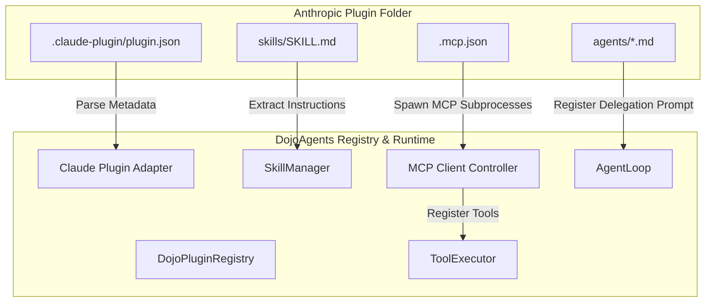

# Integrating Anthropic's Financial Services Plugins into DojoAgents

This document outlines the architectural plan to integrate the reference workflows, skills, and tools from Anthropic's official [financial-services](https://github.com/anthropics/financial-services) repository into DojoAgents, using the modular plugins framework.

---

## 1. Overview of Anthropic's Financial Services Plugin Design

The `anthropics/financial-services` repository exposes domain-specific workflow automation (such as *Pitch Agent*, *Market Researcher*, *KYC Screener*, and *Month-End Closer*) configured as **Claude Cowork / Claude Code** plugins. 

These plugins share a standard directory-based structure:
1. **Metadata Manifest (`.claude-plugin/plugin.json`)**: JSON file defining the plugin identifier, description, and author.
2. **Procedural Knowledge (`skills/SKILL.md`)**: Detailed Markdown guidelines instructing the model on financial calculations, template parsing, or process logic.
3. **Data Connectors (`.mcp.json`)**: Configures Model Context Protocol (MCP) servers (e.g. connections to Morningstar, PitchBook, FactSet, or custom spreadsheets/databases).
4. **Slash Commands (`commands/`)**: User-facing slash operations.
5. **Specialized Subagents (`agents/`)**: System prompts for child agents delegated by the parent loop.

---

## 2. Integration Mapping Model for DojoAgents

To load and execute these plugins within DojoAgents, we introduce a **Claude Plugin Adapter** layer inside `DojoPluginRegistry`.



### 2.1 Metadata Translation
* **Mechanism**: During discovery, if `DojoPluginRegistry` finds a directory containing `.claude-plugin/plugin.json`, it registers it as a `PluginManifest` with `source="claude"`.
* **Dojo Manifest Representation**:
  ```python
  manifest = PluginManifest(
      name=json_meta["name"],
      version=json_meta.get("version", "0.1.0"),
      description=json_meta.get("description", ""),
      source="claude",
      path=plugin_path
  )
  ```

### 2.2 Skill Ingestion into `SkillManager`
* **Mechanism**: Claude skills (`skills/*.md`) are written as markdown files with prompt instructions (e.g. comp spreadsheet updates or Kyc checklist rules).
* **Dojo mapping**:
  - The adapter reads all `skills/*.md` files inside the plugin folder.
  - It dynamically registers these files with the DojoAgents `SkillManager`.
  - In `AgentLoop._build_messages`, the skill manager's registered prompts are dynamically injected into the system prompt when the session starts or when relevant keywords match.

### 2.3 MCP Bridge for Data Connectors
Since Anthropic financial plugins rely heavily on MCP to pull live financial data, DojoAgents must implement a client-side MCP manager.

1. **MCP Client Registry**:
   Create `dojoagents/plugins/mcp_client.py` which spawns the MCP processes defined in the plugin's `.mcp.json` file via `subprocess.Popen` (using stdin/stdout for communication).
2. **Dynamic Tool Schema discovery**:
   - The MCP client queries the server using standard MCP JSON-RPC protocol (`tools/list`).
   - For each returned tool, it converts the schema into a Dojo `ToolSpec` and registers it in `ToolExecutor.registry`.
3. **Execution Routing**:
   When the LLM calls an MCP tool, `ToolExecutor` catches the name, matches it to the MCP server, sends a JSON-RPC request (`tools/call`), and returns the output to the agent loop.

```json
// Sample tool translation from .mcp.json config:
{
  "mcpServers": {
    "pitchbook-data": {
      "command": "node",
      "args": ["/path/to/pitchbook_mcp/index.js"]
    }
  }
}
```

### 2.4 Subagent Delegation
* **Mechanism**: Financial workflows delegate complex tasks (like building an Excel model) to specialized subagents defined in `agents/`.
* **Dojo mapping**:
  - The adapter registers subagent definitions as named templates in the system.
  - A built-in delegation tool `delegate_task(agent_name: str, task: str)` is exposed to the main agent.
  - When invoked, the tool spawns a child `AgentLoop` instance pre-configured with the system prompt loaded from `agents/{agent_name}.md` to run the task, then reports back.

---

## 3. Step-by-Step Implementation Strategy

To implement this bridge in DojoAgents, follow this structural upgrade checklist:

### Phase 1: Support Claude Manifest Discovery
* Modify `dojoagents/plugins/registry.py` to check for `.claude-plugin/plugin.json`.
* Register files found inside `skills/` and `agents/` directories.

### Phase 2: Implement MCP Client Controller
* Implement `dojoagents/plugins/mcp_client.py` supporting stdio JSON-RPC.
* Dynamically bridge tool definitions fetched from MCP servers into the `ToolExecutor`.

### Phase 3: Add Subagent Delegation Tool
* Introduce a standardized `delegate_task` tool to allow multi-agent orchestration.
* Map incoming Claude agent markdown files to these subagent scopes.
