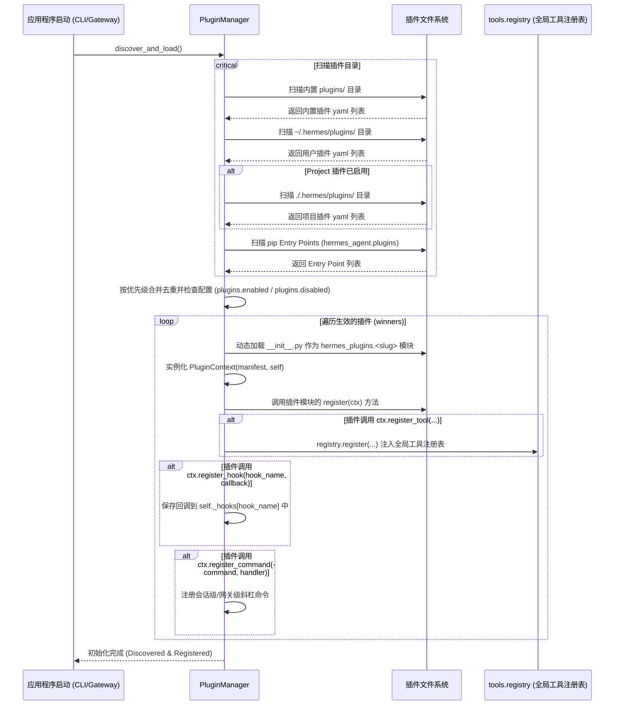

# Hermes Agent 插件系统架构分析报告

Hermes Agent 提供了一个极其灵活且可扩展的插件系统，用于发现、加载和管理各种自定义功能。本报告深入探讨插件系统的实现原理，并详细解析 Agent 是如何执行这些插件的。

---

## 一、 插件系统概述与目录结构

Hermes Agent 的插件主要分为以下几类，各自有不同的生命周期和加载机制：
1. **Bundled 插件**：随仓库内置发布的插件，保存在 `<repo>/plugins/<name>/` 下。
2. **User 插件**：用户保存在宿主目录下的自定义插件，路径为 `~/.hermes/plugins/<name>/`。
3. **Project 插件**：特定项目的本地插件，保存在 `./.hermes/plugins/<name>/` 下（需通过环境变量 `HERMES_ENABLE_PROJECT_PLUGINS=1` 启用）。
4. **Pip 插件**：通过 `pip` 安装并通过 Python `entry_points`（group 为 `hermes_agent.plugins`）暴露的第三方包。

### 插件目录结构规范
每个目录型插件必须包含以下两个文件：
* **`plugin.yaml` / `plugin.yml`**：描述插件元数据（如 `name`, `version`, `kind`, `requires_env`, `provides_tools`, `provides_hooks`）。
* **`__init__.py`**：导出 `register(ctx: PluginContext)` 函数。

`kind` 属性决定了插件的形态，主要有 5 种模式：
* `standalone`（默认）：独立插件，注册自己的 hooks/tools，由用户配置 `plugins.enabled` 显式启用。
* `backend`：核心工具的替换后端（如 `image_gen`）。内置的后端会自动加载，用户安装的后端仍需配置启用。
* `exclusive`：独占型品类插件（如内存提供者 `memory/`）。通过 `<category>.provider` 显式激活，常规插件管理器不加载其模块。
* `platform`：网关消息平台适配器（如 Telegram, Slack, Matrix 等）。内置的平台插件自动加载，第三方平台插件需显式启用。
* `model-provider`：推理后端驱动插件，由 `providers/` 目录下的延迟加载系统驱动。

---

## 二、 插件加载与注册流程 (Registration Flow)

当 Hermes 启动时，`PluginManager` 负责扫描所有的插件源并执行加载。加载遵循**“后者覆盖前者”**原则（项目插件 > 用户插件 > 内置插件）。

### 1. 扫描与加载时序图



### 2. 加载机制的关键实现细节

在 [plugins.py](file:///Users/kk1999/Local_Documents/code/hermes-agent/hermes_cli/plugins.py#L1236-L1272) 中，是通过 `sys.modules` 构建一个名为 `hermes_plugins` 的命名空间包，再将各插件目录作为子模块进行动态导入：
```python
# 动态加载目录插件的核心逻辑
spec = importlib.util.spec_from_file_location(
    module_name, # 形如 hermes_plugins.image_gen__openai
    init_file,
    submodule_search_locations=[str(plugin_dir)],
)
module = importlib.util.module_from_spec(spec)
sys.modules[module_name] = module
spec.loader.exec_module(module)
```

---

## 三、 Agent 执行插件的三大机制

插件加载完成后，Agent 在执行时通过以下三种机制与其发生交互：

### 机制 1：生命周期钩子 (Lifecycle Hooks)
这是最主要的执行方式。Agent 核心组件在特定的执行阶段调用 `invoke_hook(hook_name, **kwargs)`，依次触发所有对该 hook 注册了回调函数的插件。

```mermaid
graph TD
    UserMsg([1. 用户输入消息]) --> start[on_session_start: 仅新会话触发]
    start --> pre_llm[pre_llm_call: 注入上下文到用户输入]
    pre_llm --> pre_api[pre_api_request: 发送 API 请求前]
    pre_api --> API[调用大模型 API]
    API --> post_api[post_api_request: 收到 API 响应]
    
    subgraph 工具调用迭代 (Tool-Calling Loop)
        post_api --> pre_tool[pre_tool_call: 安全拦截/防火墙过滤]
        pre_tool --> ToolExec{执行具体工具}
        ToolExec -- 拦截阻断 --> ToolError[返回 blocked 错误给模型]
        ToolExec -- 正常执行 --> post_tool[post_tool_call: 观察工具耗时/输出]
        post_tool --> trans_tool[transform_tool_result: 重写工具执行结果]
        trans_tool --> LoopCheck{是否继续调用工具?}
        LoopCheck -- 是 --> pre_tool
    end

    LoopCheck -- 否 --> trans_llm[transform_llm_output: 修改/过滤最终回答]
    trans_llm --> post_llm[post_llm_call: 记录/同步最终会话]
    post_llm --> on_end[on_session_end: 释放资源/清理缓冲]
    on_end --> Answer([2. 输出最终回答给用户])
```

#### 全部 17 个内置生命周期钩子汇总：

| 钩子名称 (Hook Name) | 调用时机与源文件 | 传递参数 | 插件回调返回值作用 |
| :--- | :--- | :--- | :--- |
| **`on_session_start`** | 新会话建立时 ([conversation_loop.py](file:///Users/kk1999/Local_Documents/code/hermes-agent/agent/conversation_loop.py#L162)) | `session_id`, `model`, `platform` | 无（仅供初始化观察） |
| **`pre_llm_call`** | Agent 开始处理用户消息前 ([conversation_loop.py](file:///Users/kk1999/Local_Documents/code/hermes-agent/agent/conversation_loop.py#L505)) | `session_id`, `user_message`, `conversation_history`, `is_first_turn`, `model`, `platform`, `sender_id` | 可以返回 `{"context": "..."}` 或纯文本。Agent 会将它们自动拼接到该轮 user message 的尾部，辅助检索/增强，且该注入是临时的，不污染会话数据库。 |
| **`pre_api_request`** | 构造好 LLM 格式消息、即将发起 API 调用前 ([conversation_loop.py](file:///Users/kk1999/Local_Documents/code/hermes-agent/agent/conversation_loop.py#L1005)) | `task_id`, `session_id`, `user_message`, `conversation_history`, `platform`, `model`, `provider`, `base_url`, `api_mode`, `api_call_count`, `request_messages`, `message_count`, `tool_count`, `approx_input_tokens` | 无。通常用于计算输入 Token 数、执行 API 级别审计。 |
| **`post_api_request`** | API 调用返回、大模型输出后 ([conversation_loop.py](file:///Users/kk1999/Local_Documents/code/hermes-agent/agent/conversation_loop.py#L2960)) | `task_id`, `session_id`, `platform`, `model`, `provider`, `base_url`, `api_mode`, `api_call_count`, `api_duration`, `finish_reason`, `message_count`, `response_model`, `response`, `usage`, `assistant_message`, `assistant_content_chars`, `assistant_tool_call_count` | 无。通常用于记录响应指标、性能分析。 |
| **`pre_tool_call`** | 工具运行分发前 ([model_tools.py](file:///Users/kk1999/Local_Documents/code/hermes-agent/model_tools.py#L788)) | `tool_name`, `args`, `task_id`, `session_id`, `tool_call_id` | **强副作用阻断**：若返回 `{"action": "block", "message": "错误原因"}`，Agent 将不执行该工具，并直接向大模型返回该 error，作为安全防火墙拦截高危操作。 |
| **`post_tool_call`** | 工具运行成功/失败后 ([model_tools.py](file:///Users/kk1999/Local_Documents/code/hermes-agent/model_tools.py#L851)) | `tool_name`, `args`, `result`, `task_id`, `session_id`, `tool_call_id`, `duration_ms` | 无。通常用于耗时统计、审计。 |
| **`post_tool_call`** | 工具运行成功/失败后 ([model_tools.py](file:///Users/kk1999/Local_Documents/code/hermes-agent/model_tools.py#L851)) | `tool_name`, `args`, `result`, `task_id`, `session_id`, `tool_call_id`, `duration_ms` | 无。通常用于耗时统计、审计。 |
| **`transform_tool_result`** | 工具执行返回后，拼接回上下文前 ([model_tools.py](file:///Users/kk1999/Local_Documents/code/hermes-agent/model_tools.py#L872)) | `tool_name`, `args`, `result`, `task_id`, `session_id`, `tool_call_id`, `duration_ms` | **修改输出**：可返回替代字符串（第一个返回非空字符串的插件生效），改写返回给大模型的内容。 |
| **`transform_terminal_output`**| 终端工具运行后，截断操作前 ([terminal_tool.py](file:///Users/kk1999/Local_Documents/code/hermes-agent/tools/terminal_tool.py#L2088)) | `command`, `output`, `returncode`, `task_id`, `env_type` | **修改终端输出**：可修改 shell 命令返回的 std_out/err 文本。 |
| **`transform_llm_output`** | 轮询结束、LLM 给出最终回复前 ([conversation_loop.py](file:///Users/kk1999/Local_Documents/code/hermes-agent/agent/conversation_loop.py#L3943)) | `response_text`, `session_id`, `model`, `platform` | **修改回复**：允许重写输出文本（如隐藏敏感字符、增加特定语气等），第一个返回的非空 string 生效。 |
| **`post_llm_call`** | 本轮对话输出最终回答后 ([conversation_loop.py](file:///Users/kk1999/Local_Documents/code/hermes-agent/agent/conversation_loop.py#L3964)) | `session_id`, `user_message`, `assistant_response`, `conversation_history`, `model`, `platform` | 无。常用于做多轮外部记忆同步、存储摘要。 |
| **`on_session_end`** | 整个 `run_conversation` 调用即将结束前 ([conversation_loop.py](file:///Users/kk1999/Local_Documents/code/hermes-agent/agent/conversation_loop.py#L4079)) | `session_id`, `completed`, `interrupted`, `model`, `platform` | 无。做一些单次会话轮次的最终状态同步和资源清空。 |
| **`on_session_finalize`** | 会话清理销毁时 ([cli.py](file:///Users/kk1999/Local_Documents/code/hermes-agent/cli.py#L778), [gateway/run.py](file:///Users/kk1999/Local_Documents/code/hermes-agent/gateway/run.py#L3227)) | `session_id`, `platform` | 无。释放长连接或清理临时沙箱。 |
| **`on_session_reset`** | 会话重置时 ([cli.py](file:///Users/kk1999/Local_Documents/code/hermes-agent/cli.py#L6109), [gateway/run.py](file:///Users/kk1999/Local_Documents/code/hermes-agent/gateway/run.py#L9120)) | `session_id`, `platform` | 无。 |
| **`pre_gateway_dispatch`** | Gateway 收到即时消息、派发给具体会话前 ([gateway/run.py](file:///Users/kk1999/Local_Documents/code/hermes-agent/gateway/run.py#L6449)) | `event`, `gateway`, `session_store` | **控制事件流**：返回 `{"action": "skip", "reason": "..."}` 丢弃消息不作回复；返回 `{"action": "rewrite", "text": "..."}` 重写用户输入文本。 |
| **`pre_approval_request`** | 危险命令交互式/网关级审批提示弹出前 ([approval.py](file:///Users/kk1999/Local_Documents/code/hermes-agent/tools/approval.py#L1209)) | `command`, `description`, `pattern_key`, `pattern_keys`, `session_key`, `surface` | 无。可以触发系统级消息通知（如 macOS 提示、Slack 推送危险警告）。 |
| **`post_approval_response`** | 用户处理完审批（同意/拒绝/超时）后 ([approval.py](file:///Users/kk1999/Local_Documents/code/hermes-agent/tools/approval.py#L1291)) | 包含 pre_approval_request 的所有参数以及 `choice` (如 `once`, `session`, `always`, `deny`, `timeout`) | 无。审计和记录用户的授权安全行为。 |
| **`subagent_stop`** | 子代理（Subagent）退出结束时 ([delegate_tool.py](file:///Users/kk1999/Local_Documents/code/hermes-agent/tools/delegate_tool.py#L2269)) | `parent_session_id`, `subagent_session_id`, `task_id`, `outcome` 等 | 无。主要用于观察多代理编排协作状态。 |

为了防止任何异常插件崩溃导致 Agent 死亡，`invoke_hook` 在执行插件的 callback 时使用了容错包装：
```python
for cb in callbacks:
    try:
        ret = cb(**kwargs)
        if ret is not None:
            results.append(ret)
    except Exception as exc:
        logger.warning("Hook '%s' callback %s raised: %s", hook_name, cb.__name__, exc)
```

---

### 机制 2：扩展大模型的工具表 (Plugin Tools)

插件可以在 `register` 时调用 `ctx.register_tool(name, toolset, schema, handler, ...)` 注入系统。

1. **注册**：`PluginContext` 桥接到全局 `tools.registry`：
   ```python
   def register_tool(self, name, toolset, schema, handler, ...):
       registry.register(name=name, toolset=toolset, schema=schema, handler=handler, ...)
       self._manager._plugin_tool_names.add(name)
   ```
2. **暴露给模型**：在 API 请求前的组装阶段，`get_tool_definitions()` 会自动去全局 `registry` 检索已经被插件注册的工具，将其 Schema 翻译为 OpenAI Tool format 塞给模型。
3. **分发执行**：当大模型给出 `tool_calls` 要求执行该工具时，核心 Loop 调用 `handle_function_call(function_name, function_args)`：
   * 首先转换并自动强制转换参数类型 (`coerce_tool_args`)。
   * 接着，调用 `registry.dispatch(function_name, function_args)`。
   * 注册表会自动匹配到插件的 `handler` 回调方法并在 Python 中运行，将返回结果传递回 Agent Loop。

---

### 机制 3：会话级斜杠命令 (Slash Commands) 与 CLI 子命令

插件可以注册在命令行交互中触发的逻辑：

1. **CLI 终端命令**：注册为 `hermes <subcommand>`，例如 `hermes honcho ...`，由 `PluginContext.register_cli_command(...)` 处理，直接绑定到主 argparse 解析器中。
2. **会话级斜杠命令**：注册为对话框内的 `/command`（如 `/lcm`），由 `PluginContext.register_command(name, handler)` 注册。
   * 当用户输入以 `/` 开头的文本时，网关和 CLI 都会调用 `get_plugin_command_handler(name)` 获取对应的 handler 回调。
   * **异步处理机制**：在 [plugins.py:resolve_plugin_command_result](file:///Users/kk1999/Local_Documents/code/hermes-agent/hermes_cli/plugins.py#L1496-L1540) 中，如果插件注册的回调是异步协程（`async def`），且当前正运行在已有事件循环（Event Loop）的主线程中，Hermes 会**启动一个守护线程并在其内部创建独立 Loop** 去同步等待协程结果，同时设置了 **30 秒超时阈值**，保障主会话不会因插件阻塞而死锁。

---

### 机制 4：第三方底层 Providers 的替换挂载

Hermes 开放了大量底层业务架构接口，允许插件通过 Context 注册自己的驱动实例来替换系统默认实现：

* **`ctx.register_context_engine(engine)`**：替换内置的上下文压缩/修剪器 `ContextCompressor`。
* **`ctx.register_image_gen_provider(provider)`**：注册第三方图像生成后端（如 DALL-E, SD, Flux 驱动），模型调用 `image_generate` 工具时自动路由。
* **`ctx.register_video_gen_provider(provider)`**：注册视频生成驱动。
* **`ctx.register_web_search_provider(provider)`**：注册网页检索后端，供 `web_search`/`web_extract` 使用。
* **`ctx.register_browser_provider(provider)`**：注册云端浏览器实例（Cloud Browser Driver）。
* **`ctx.register_platform(...)`**：将第三方通讯渠道（如 IRC 协议）接入网关收发队列。
* **`ctx.register_skill(...)`**：注册只读型技能文件（`SKILL.md`），使之作为显式导入资源供主程序检索。

---

## 四、 总结

Hermes Agent 的插件架构基于 **“核心轻量化、业务切片化”** 的设计理念。通过暴露 17 个生命周期钩子（Hooks）、动态全局工具注册表（Tools Registry） and 底层驱动插槽，极大地增强了系统的延展性。Agent 通过 `PluginManager` 将第三方插件沙盒式隔离装载，同时在主循环的各关键截面上执行安全监控与输出重写，在保证灵活性的同时，也通过单点捕获机制（如 pre_tool_call block）维护了系统安全。
