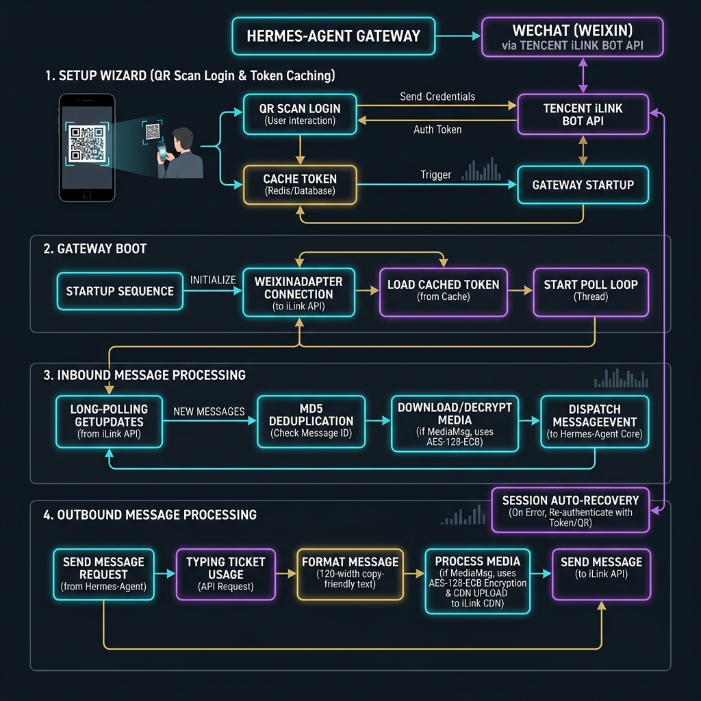
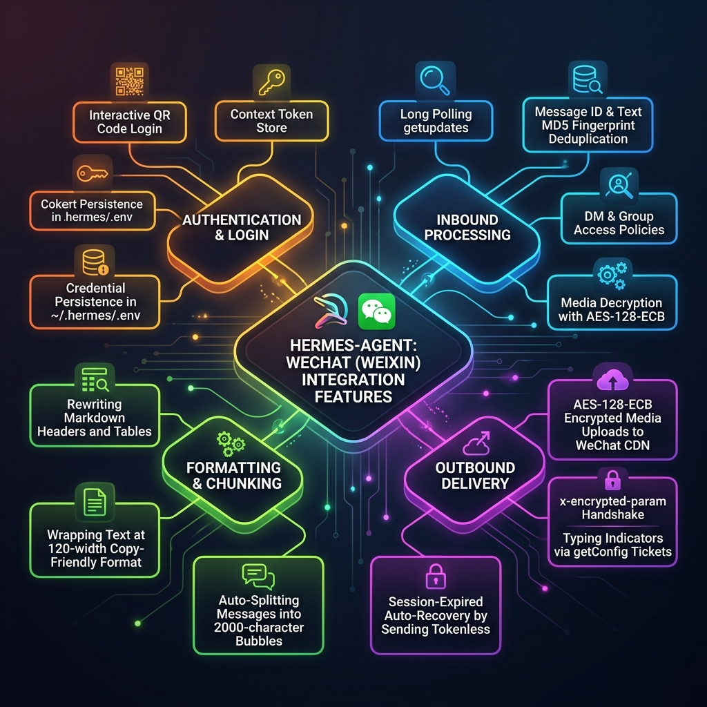

# Hermes-Agent WeChat (Weixin) Integration Architecture

This document provides a detailed technical summary of how `hermes-agent` integrates with WeChat personal accounts via Tencent iLink Bot API.

It outlines the complete interaction lifecycle from interactive CLI setup, gateway startup, inbound polling and media processing, to agent execution and outbound message delivery.

---

## 1. Overall Interaction Flowchart

Below is the visual diagram illustrating the interaction sequence between WeChat (Weixin), Tencent iLink, the Hermes Gateway, and the Core AI Agent.

---

## 2. Technical Process Breakdown

### Phase A: Setup & QR Code Authentication
1. **Initiation**: The user runs `hermes gateway setup` and selects Weixin, triggering the interactive command in [hermes_cli/gateway.py](file:///Users/kk1999/Local_Documents/code/hermes-agent/hermes_cli/gateway.py#L4215-L4347).
2. **QR Code Fetching**: The setup wizard invokes `qr_login()` from [weixin.py](file:///Users/kk1999/Local_Documents/code/hermes-agent/gateway/platforms/weixin.py#L1041-L1174), which queries the Tencent iLink Bot API (`ilink/bot/get_bot_qrcode`) to retrieve a `qrcode` hex value and `qrcode_img_content` URL.
3. **User Scanning**: The CLI prints the URL and renders an ASCII QR code in the terminal using the `qrcode` library. The user scans it using their WeChat app and authorizes the login.
4. **Status Polling**: Hermes polls the status of the login at `ilink/bot/get_qrcode_status` every second. Once confirmed, Tencent iLink returns:
   - `ilink_bot_id` (Account ID)
   - `bot_token` (Authorization Token)
   - `baseurl` (Redirect Host)
   - `ilink_user_id` (Owner User ID)
5. **Credential Caching**: The wizard saves Weixin settings in `~/.hermes/.env` (credentials like `WEIXIN_TOKEN`, `WEIXIN_ACCOUNT_ID`) and writes a JSON configuration file under `~/.hermes/weixin/accounts/{account_id}.json`.

---

### Phase B: Gateway Boot & Adapter Connection
1. **Creation**: When `hermes gateway start` executes, `gateway/run.py` parses the gateway config. If `Platform.WEIXIN` is enabled, it imports and instantiates the `WeixinAdapter` in [gateway/run.py](file:///Users/kk1999/Local_Documents/code/hermes-agent/gateway/run.py#L6022-L6028).
2. **Connection Lifecycle**: `WeixinAdapter.connect()` is called:
   - **Concurrency Guard**: It acquires a file lock (`weixin-bot-token`) based on the bot token to prevent multiple active instances of the same bot.
   - **HTTP Sessions**: It opens two `aiohttp.ClientSession` instances: `_poll_session` for pulling updates and `_send_session` for sending replies.
   - **Context Token Restoration**: It restores saved peer `context_token` mappings from disk using the `ContextTokenStore`. In iLink, outbound messages require the latest context token associated with that WeChat contact to maintain active session routing.
   - **Background Polling Task**: It spins up an async background task to run the polling loop `_poll_loop()`.

---

### Phase C: Inbound Message Handling (WeChat ➔ Hermes)
1. **Long Polling Loop**: The adapter's `_poll_loop()` sends a long poll POST request to Tencent's iLink endpoint `ilink/bot/getupdates` using the latest sync buffer string (`get_updates_buf`).
2. **Deduplication**: Upon receiving messages, the adapter checks them via a `MessageDeduplicator`:
   - Checks the unique `message_id` from Tencent.
   - Computes an MD5 hash of text content to guard against immediate burst duplicates.
3. **Authorization & Policies**: It filters messages based on security rules:
   - **DM Policy** (`WEIXIN_DM_POLICY`): Can be `open` (anyone), `allowlist` (explicit user IDs), or `pairing` (approved via pairing command).
   - **Group Policy** (`WEIXIN_GROUP_POLICY`): Since iLink bots cannot easily join regular WeChat groups, this is usually `disabled`, but can be set to `open` or `allowlist` if the bot type supports group events.
4. **Context Token Caching**: It intercepts the `context_token` in the incoming packet and saves it in the `ContextTokenStore` to use for subsequent outbound messages.
5. **Typing Ticket Collection**: It launches a background check to retrieve a short-lived `typing_ticket` for the contact via `ilink/bot/getconfig`. This ticket is cached so Hermes can show a "typing..." bubble on WeChat while thinking.
6. **Decryption of Media**: If the message contains an image, video, file, or voice message:
   - It requests a download from WeChat's CDN.
   - WeChat encrypts all CDN payloads. The adapter downloads the raw ciphertext, retrieves the AES-128 key from the message structure, decrypts the binary data using **AES-128-ECB**, and saves it into the local cache (`~/.hermes/cache/...`).
7. **Message Handoff**: The adapter builds a `MessageEvent` containing the text, media files, and sender details and calls `await self.handle_message(event)`.
8. **Session Locking**: In `BasePlatformAdapter.handle_message()` in [base.py](file:///Users/kk1999/Local_Documents/code/hermes-agent/gateway/platforms/base.py#L2866-L3049):
   - It builds a session key. If the session is already active (i.e. Agent is processing a previous prompt from the same user), it queues the new message and signals an interrupt (`Event.set()`) to abort the running agent.
   - If idle, it locks the session synchronously and spawns `_process_message_background()` to run the AI Agent.

---

### Phase D: Agent Processing
- The `AIAgent` conversation loop is executed. The agent processes the input text and attached files, executes internal tools (terminal, code execution, web browser), and returns the final text response.

---

### Phase E: Outbound Message Handling (Hermes ➔ WeChat)
1. **Typing Indicator**: While the agent runs, the adapter runs a concurrent loop sending `ilink/bot/sendtyping` start packets using the cached `typing_ticket` to keep the WeChat "typing" indicator active.
2. **Text Formatting & Beautification**:
   - Normalizes markdown layout.
   - Strips or rewrites markdown headers (e.g. `# Title` -> `【Title】`) and table layouts because WeChat's mobile client does not render them correctly.
   - Wraps lengthy display output into copy-friendly lines of maximum 120 character width (`WEIXIN_COPY_LINE_WIDTH`).
3. **Text Chunking**: WeChat has a maximum message length of 2000 characters. Hermes splits the formatted message into sequential blocks.
4. **Sending Text**: For each chunk, it calls `_send_text_chunk()` to POST to `ilink/bot/sendmessage` along with the contact's cached `context_token`.
   - **Session Expiry Auto-Recovery**: If iLink returns `errcode: -14` (session expired) or a stale session response, the adapter automatically pops the cached context token and **retries the POST without it**. Tencent iLink accepts tokenless payloads as a fallback, enabling cron notification delivery even when WeChat has cleared the user context.
5. **Uploading Media Attachments**: If the agent's output contains local media attachments (images, video, or files):
   - **Metadata Exchange**: It requests an upload slot from `ilink/bot/getuploadurl` by supplying the file's size, MD5 hash, a randomly generated 16-byte hex `filekey`, and a random 16-byte AES key.
   - **AES Encryption**: The adapter encrypts the media file bytes using **AES-128-ECB**.
   - **CDN POST**: It POSTs the encrypted ciphertext to the returned WeChat CDN upload URL.
   - **Handshake**: The CDN returns a header containing `x-encrypted-param` (also known as `encrypt_query_param`).
   - **API Delivery**: The adapter builds a media item message containing the `encrypt_query_param` and the `aes_key` (encoded as base64-hex string, which Tencent requires to prevent gray box errors), and sends it to `ilink/bot/sendmessage`.

---

## 3. WeChat Integration Features Map

Below is a mind map outlining the functional modules and sub-components implemented within the Hermes-Agent WeChat integration system.

---

## 4. Key Functions Summary Table

The table below lists the essential internal functions and their responsibilities inside [weixin.py](file:///Users/kk1999/Local_Documents/code/hermes-agent/gateway/platforms/weixin.py):

| Function / Class | Description |
| :--- | :--- |
| `qr_login()` | Handles WeChat terminal QR-code rendering and login status polling. |
| `WeixinAdapter.connect()` | Registers the adapter, creates `aiohttp` poll/send sessions, loads caches, and starts the polling task. |
| `WeixinAdapter._poll_loop()` | Continuously executes `ilink/bot/getupdates` requests and parses inbound message lists. |
| `WeixinAdapter._process_message()` | Performs deduplication, authorization checks, updates the `context_token`, and handles media decryption. |
| `_download_and_decrypt_media()` | Downloads encrypted media ciphertext from WeChat CDN and decrypts it via AES-128-ECB. |
| `_split_text_for_weixin_delivery()` | Splits long texts into WeChat-friendly bubbles (< 2000 chars) depending on layout settings. |
| `WeixinAdapter.send()` | Primary message dispatcher. Extracts media tags, uploads them first, and chunk-delivers text. |
| `_send_message()` | Communicates with the Tencent `ilink/bot/sendmessage` endpoint with text/media items. |
| `_send_file()` | Orchestrates the entire outbound media upload flow: metadata handshake, encryption, CDN POST, and final notification. |
| `ContextTokenStore` | Handles saving and loading persistent peer-to-bot routing context tokens. |
| `TypingTicketCache` | Caches short-lived typing tokens to allow "typing..." indicators. |
| `send_weixin_direct()` | Standalone one-shot sender utility used by cron jobs and notifications without a live polling instance. |
