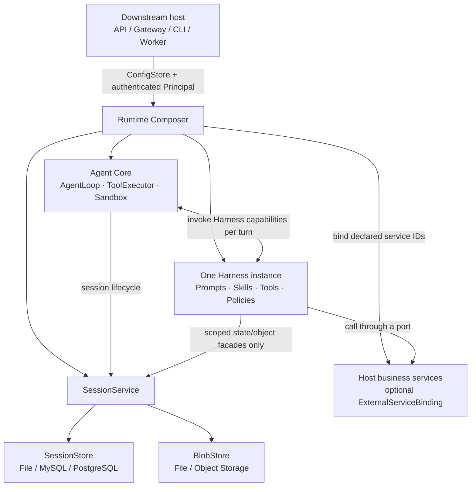
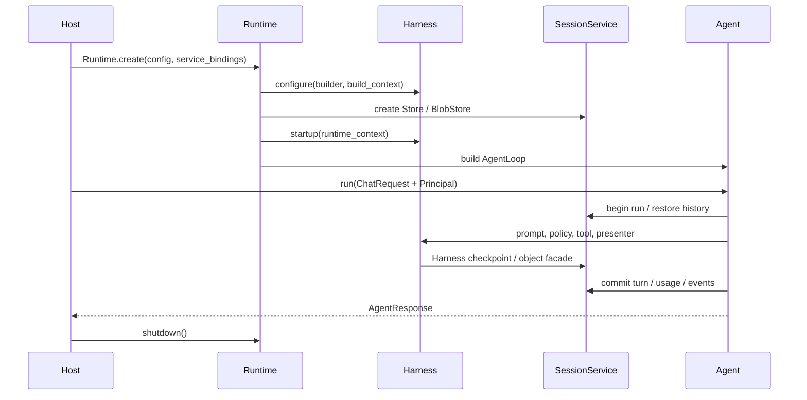
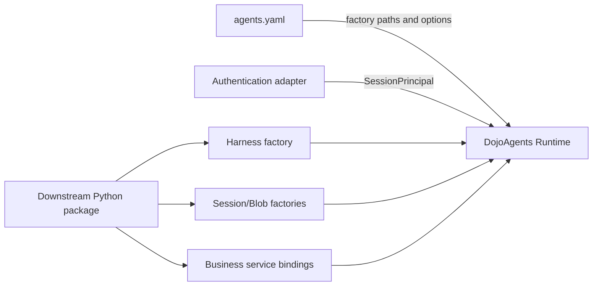

# Harness, Agent, and Session Architecture

This page describes the stable Agent, Harness, Runtime, and Session boundaries after the Harness extraction, and shows how a downstream project integrates DojoAgents.

## Core model

A running `Runtime` assembles exactly one Agent instance and one Harness instance. There is no primary Harness, and multiple Harnesses are not stacked on one Agent.

- **Agent Core** provides the generic model loop, tool execution, sandbox, events, context, and error boundaries. It contains no scenario-specific business behavior.
- **Harness** defines one scenario's identity, prompts, skills, tools, memory, policies, tasks/pipelines, presenters, and recoverable state.
- **Runtime Composer** loads the Harness, validates its capability graph, creates Session infrastructure, binds host services, and starts or stops resources in dependency order.
- **Session** persists business-neutral sessions, messages, runs, turns, events, usage, checkpoints, and objects, always scoped by tenant and user.
- **Host application** is a FastAPI service, gateway, CLI, worker, or downstream application. The host owns authentication, business services, and transport protocols.



The dependency direction is:

```text
Host App -> Runtime / Agent Core / Harness contracts
Harness  -> Agent, Tool, and Session contracts
Core     -> Harness framework contracts

Core     -X-> concrete Harnesses
Harness  -X-> Dashboard/FastAPI routes
Session  -X-> business-domain implementations
```

## Lifecycle and state isolation

`Runtime.create()` performs the complete asynchronous assembly:

1. Read typed configuration from `ConfigStore`.
2. Load and instantiate one Harness.
3. Call `Harness.configure()`, freeze the capability graph, and validate IDs, tool names, and dependencies.
4. Create the `SessionStore`, `BlobStore`, and `SessionService`.
5. Bind host-provided services and start Harness services in dependency order.
6. Call `Harness.startup()`, then build the runnable Agent.
7. `Runtime.shutdown()` closes the Harness, services, and stores in reverse order.



State has three scopes:

| Scope | Lifetime | Purpose | Persistence |
| --- | --- | --- | --- |
| Runtime state | Harness instance lifetime | Connection pools, caches, and instance-local shared resources | Not persisted by default |
| Session state | `(tenant_id, user_id, session_id, harness_id)` | Recoverable workflows, scenario preferences, business context | Harness codec checkpoint |
| Turn state | One Agent turn | Temporary counters, policy decisions, tool traces | Never long-lived state |

One Runtime may serve many Sessions, but those Sessions never share `HarnessSessionState` or `HarnessTurnState`.

## Session design

### Identity is a storage boundary

Every online entry point must map trusted authentication into:

```python
from dojoagents.sessions.models import SessionPrincipal

principal = SessionPrincipal(
    tenant_id="tenant-a",
    user_id="user-42",
    roles=frozenset({"analyst"}),
)
```

An external `session_id` is unique only within `(tenant_id, user_id)`. Store queries must receive `SessionPrincipal` directly. Never load by `session_id` and check ownership later in application code. A `user_id` in a request body, query string, or OpenAI compatibility field cannot override the authenticated principal.

### Generic data and Harness data

`SessionStore` persists:

- sessions, agents, and messages;
- runs, turns, events, and usage;
- leases, cancellation state, and fencing tokens;
- checkpoint metadata;
- object metadata for inputs, outputs, and artifacts.

`BlobStore` persists the binary content of inputs, outputs, and artifacts. Session objects store only a `BlobRef`, so a database backend can be combined with file or object storage.

A Harness does not create private session tables or construct session file paths. It accesses `HarnessSessionStateFacade` under:

```text
harness:<harness_id>
```

The checkpoint records the Harness ID, Harness version, and state schema version. `HarnessStateCodec.migrate()` handles state upgrades.

### Concurrency and recovery

- Leases and fencing tokens prevent expired workers from committing writes.
- Run idempotency keys prevent duplicate runs during retries.
- Durable events support SSE resume; a message bus is only a low-latency notification mechanism.
- Session and checkpoint versions provide optimistic concurrency control.
- Every `SessionStore` and `BlobStore` implements `startup()`, `health()`, and `shutdown()`.

## Downstream project: define a Harness

Recommended package layout:

```text
my_project/
├── agent_harness/
│   ├── __init__.py
│   ├── harness.py
│   ├── prompts.py
│   ├── policies.py
│   ├── tools.py
│   └── state.py
├── services/
├── session_backends/
└── agents.yaml
```

A minimal Harness:

```python
# my_project/agent_harness/harness.py
from dojoagents.harnesses.base import HarnessDescriptor
from dojoagents.harnesses.capabilities import IdentitySpec, ToolProviderSpec
from dojoagents.tools.registry import ToolSpec


async def echo(arguments):
    return {"echo": arguments.get("text", "")}


class CustomerSupportHarness:
    descriptor = HarnessDescriptor(
        id="customer-support",
        version="1.0.0",
        display_name="Customer Support",
        state_schema_version=1,
        supported_channels=("api", "gateway"),
    )

    def configure(self, builder, context):
        source = "harness:customer-support"
        builder.set_identity(
            IdentitySpec(
                "support.identity",
                source,
                identity="You are a customer support agent.",
            )
        )
        builder.add_tool_provider(
            ToolProviderSpec(
                "support.tools",
                source,
                provider=(
                    ToolSpec(
                        "echo",
                        "Echo text",
                        {
                            "type": "object",
                            "properties": {"text": {"type": "string"}},
                            "required": ["text"],
                        },
                        echo,
                    ),
                ),
                tool_names=("echo",),
            )
        )

    async def startup(self, context):
        return None

    async def shutdown(self, context):
        return None


def create_harness(config, context):
    return CustomerSupportHarness()
```

Configuration:

```yaml
harness:
  id: customer-support
  factory: my_project.agent_harness.harness:create_harness
  config:
    locale: en-US
  extra_skill_dirs:
    - ./skills
  extra_tool_dirs:
    - ./tools
```

`factory` uses `module:attribute`. A factory may accept no arguments, `config`, or `config, context`. Its Harness ID must match `harness.id`.

`extra_skill_dirs` and `extra_tool_dirs` supplement the selected Harness; they do not create another Harness. Duplicate component IDs or tool names fail before Runtime startup.

### Optional: declarative Harness

Use the constrained `dojoagents/v1alpha1` manifest when component relationships should remain declarative:

```yaml
# customer-support.harness.yaml
apiVersion: dojoagents/v1alpha1
kind: Harness
metadata:
  id: customer-support
  version: 1.0.0
  display_name: Customer Support
  supported_channels: [api, gateway]
components:
  identity:
    id: support.identity
    value: You are a customer support agent.
  prompts:
    - id: support.instructions
      phase: harness_instructions
      path: prompts/instructions.md
  tools:
    - id: support.tools
      factory: my_project.agent_harness.tools:create_tool_specs
      tool_names: [lookup_ticket, reply_ticket]
```

```yaml
harness:
  id: customer-support
  factory: null
  manifest: ./customer-support.harness.yaml
```

`factory` and `manifest` are mutually exclusive; set `factory: null` explicitly when using a manifest. A manifest references controlled factories and relative resources. It is not a SQL, shell, or arbitrary business-flow DSL, and it still passes through the same `HarnessBuilder` validation.

## Downstream project: bind host business services

When tools need CRM, order, or internal data services, the Harness declares a stable service ID and depends on a port. The host can replace the implementation without making the Harness depend on host application modules.

```python
from dojoagents.agent.runtime import Runtime
from dojoagents.config.loader import ConfigStore
from dojoagents.harnesses.lifecycle import ExternalServiceBinding

crm = MyCRMClient(...)
runtime = await Runtime.create(
    ConfigStore("agents.yaml"),
    host="api",
    service_bindings={
        "support.crm": ExternalServiceBinding(
            instance=crm,
            runtime_owns_lifecycle=False,
        )
    },
)
```

Rules:

- The Harness first declares the ID with `ServiceSpec(component_id="support.crm", ...)`.
- Undeclared bindings are rejected.
- `runtime_owns_lifecycle=False` means the host starts and closes the instance.
- If it is `True`, Runtime calls the service's `startup/health/shutdown` methods.

## Downstream project: replace Session storage

Local development uses the built-in file backend:

```yaml
sessions:
  enabled: true
  store:
    provider: file
    options:
      root: ~/.dojo/agents/sessions
  blob_store:
    provider: file
    options:
      root: ~/.dojo/agents/session_blobs
  runtime:
    require_user_id: true
    lease_seconds: 90
    heartbeat_seconds: 30
    event_batch_size: 20
```

An online service can provide MySQL or PostgreSQL through factories:

```yaml
sessions:
  enabled: true
  store:
    provider: mysql
    factory: my_project.session_backends.mysql:create_session_store
    options:
      dsn_env: DOJO_SESSION_DSN
      pool_size: 20
  blob_store:
    provider: object-storage
    factory: my_project.session_backends.s3:create_blob_store
    options:
      bucket: dojo-session-data
      prefix: production
  runtime:
    require_user_id: true
    lease_seconds: 90
    heartbeat_seconds: 30
```

A factory receives a copied `options` mapping and may return synchronously or asynchronously:

```python
# my_project/session_backends/mysql.py
import os


def create_session_store(options):
    return MySQLSessionStore(
        dsn=os.environ[options["dsn_env"]],
        pool_size=int(options.get("pool_size", 10)),
    )
```

`MySQLSessionStore` must implement the complete `dojoagents.sessions.store.SessionStore` protocol. Object storage must implement the complete `dojoagents.sessions.blob_store.BlobStore` protocol. Implementing only the methods currently exercised by one application is not sufficient. A custom backend must also verify:

- complete isolation for equal `session_id` values owned by different users;
- principal filtering for list, history, usage, object, archive, and export operations;
- run idempotency, lease, heartbeat, fencing, and cancellation semantics;
- checkpoint optimistic locking;
- object reserve/upload/commit compensation;
- cursor stability across restarts and multiple instances;
- observable health failures and shutdown.

Resolve DSNs and object-storage secrets from environment variables or a secret manager. Never write them to logs, Session metadata, or Harness prompts.

## Downstream project: create and call the Agent

```python
from dojoagents.agent.models import ChatRequest
from dojoagents.agent.runtime import Runtime
from dojoagents.config.loader import ConfigStore
from dojoagents.sessions.models import SessionPrincipal


async def answer(message: str, authenticated_user) -> str:
    principal = SessionPrincipal(
        tenant_id=authenticated_user.tenant_id,
        user_id=authenticated_user.id,
        roles=frozenset(authenticated_user.roles),
    )
    runtime = await Runtime.create(ConfigStore("agents.yaml"), host="api")
    try:
        response = await runtime.agent.run(
            ChatRequest(
                message=message,
                session_id="conversation-001",
                channel="api",
                principal=principal,
            )
        )
        return response.content
    finally:
        await runtime.shutdown()
```

A real online service should create Runtime during application startup and call `shutdown()` during application shutdown, rather than creating one per request. One started Runtime can serve multiple users and Sessions; each request must still carry the correct `SessionPrincipal`.



## Integration checklist

- One Agent instance is bound to exactly one Harness instance.
- A Harness does not import Dashboard, FastAPI routes, or concrete host service implementations.
- Core and Session do not import a concrete Harness.
- Harness state uses a codec and a `harness:<id>` checkpoint, not private session storage.
- API and Gateway hosts create `SessionPrincipal` from trusted authentication.
- Every Store query filters by tenant and user.
- The host manages a long-lived Runtime during startup and shutdown.
- Lifecycle ownership is explicit for every external service binding.
- Extra skills and tools only supplement the selected Harness.
- A new Session backend passes full contract, isolation, concurrency, recovery, and migration tests.
