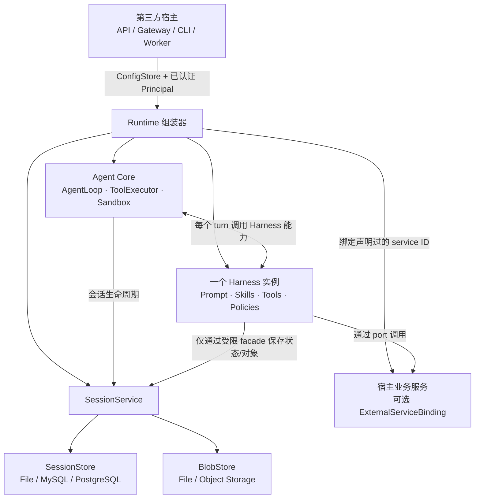
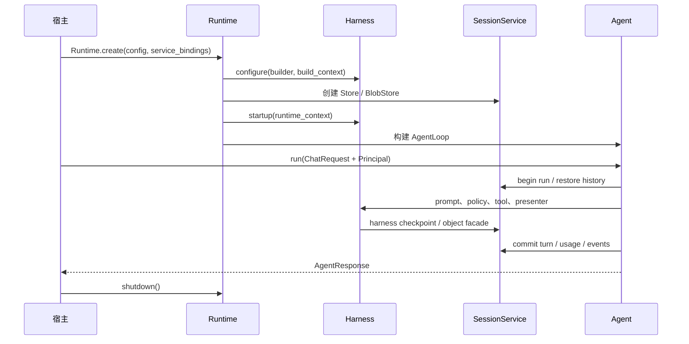
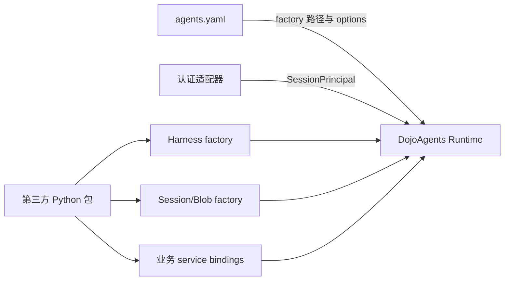

# Harness、Agent 与 Session 架构及第三方接入

本文描述 Harness 分离完成后，DojoAgents 中 Agent、Harness、Runtime 与 Session 的稳定边界，并给出第三方项目接入方式。

## 核心模型

一个运行中的 `Runtime` 只组装一个 Agent 实例和一个 Harness 实例。不存在“主 Harness”，也不在同一个 Agent 上堆叠多个 Harness。

- **Agent Core**：提供通用模型循环、工具执行、Sandbox、事件、上下文和错误边界，不包含具体业务场景。
- **Harness**：定义一个场景中的 identity、prompt、skills、tools、memory、policy、task/pipeline、presenter 和可恢复状态。
- **Runtime 组装器**：加载 Harness，验证能力图，创建 Session 基础设施，绑定宿主服务，按依赖顺序启动和关闭资源。
- **Session**：保存与业务无关的会话、消息、run、turn、event、usage、checkpoint 和 object；始终按租户和用户隔离。
- **宿主应用**：FastAPI、Gateway、CLI 或第三方服务。宿主负责认证、业务服务和传输协议，不应把这些职责放进 Harness。



依赖方向必须保持为：

```text
Host App -> Runtime / Agent Core / Harness contracts
Harness  -> Agent、Tool、Session contracts
Core     -> Harness framework contracts

Core     -X-> 具体 Harness
Harness  -X-> Dashboard/FastAPI 路由
Session  -X-> 业务领域实现
```

## 生命周期与状态隔离

`Runtime.create()` 执行完整的异步组装：

1. 从 `ConfigStore` 读取 typed config。
2. 加载且实例化一个 Harness。
3. 调用 `Harness.configure()`，生成不可变能力图并检查重复 ID、工具名和依赖。
4. 创建 `SessionStore`、`BlobStore` 和 `SessionService`。
5. 绑定宿主传入的外部服务，按依赖顺序启动 Harness 服务。
6. 调用 `Harness.startup()`，再构建可运行的 Agent。
7. `Runtime.shutdown()` 逆序关闭 Harness、服务和存储。



状态有三种作用域：

| 作用域 | 生命周期 | 用途 | 是否持久化 |
| --- | --- | --- | --- |
| Runtime state | Harness 实例存活期间 | 连接池、缓存、只属于本实例的共享资源 | 默认不持久化 |
| Session state | `(tenant_id, user_id, session_id, harness_id)` | 可恢复工作流、场景偏好、业务上下文 | 通过 Harness codec 写 checkpoint |
| Turn state | 单次 Agent turn | 临时计数、policy 决策、tool trace | 不作为长期状态 |

同一个 Runtime 可以服务多个 Session，但这些 Session 不共享 `HarnessSessionState` 或 `HarnessTurnState`。

## Session 设计

### 身份是存储边界

所有在线入口必须先把可信认证结果转换为：

```python
from dojoagents.sessions.models import SessionPrincipal

principal = SessionPrincipal(
    tenant_id="tenant-a",
    user_id="user-42",
    roles=frozenset({"analyst"}),
)
```

外部 `session_id` 只在 `(tenant_id, user_id)` 范围内唯一。Store 查询必须直接携带 `SessionPrincipal`，禁止先按 `session_id` 读取后再在应用层检查 owner。请求 body、query 或 OpenAI 兼容字段中的 `user_id` 不能覆盖认证结果。

### 通用数据与 Harness 数据

`SessionStore` 保存：

- session、agent 和 message；
- run、turn、event 和 usage；
- lease、取消状态和 fencing token；
- checkpoint 元数据；
- input、output 和 artifact 的对象元数据。

`BlobStore` 保存输入、输出和 artifact 的二进制内容。Session 对象只保存 `BlobRef`，因此数据库后端可以与文件或对象存储组合。

Harness 不创建自己的 session 表，也不拼接 session 文件路径。它通过 `HarnessSessionStateFacade` 使用命名空间：

```text
harness:<harness_id>
```

checkpoint 同时记录 Harness ID、Harness 版本和 state schema 版本。升级 Harness state 时，`HarnessStateCodec.migrate()` 负责迁移。

### 并发与恢复

- 写操作通过 lease 和 fencing token 防止失效实例继续提交。
- run 的幂等键避免请求重试产生重复运行。
- 持久化 event 支持 SSE 断线恢复；消息总线只用于降低通知延迟。
- Session 版本和 checkpoint 版本用于乐观并发控制。
- `SessionStore` 与 `BlobStore` 必须实现 `startup()`、`health()` 和 `shutdown()`。

## 第三方项目：定义 Harness

推荐目录：

```text
my_project/
├── agent_harness/
│   ├── __init__.py
│   ├── harness.py
│   ├── prompts.py
│   ├── policies.py
│   ├── tools.py
│   └── state.py
├── services/
├── session_backends/
└── agents.yaml
```

最小 Harness：

```python
# my_project/agent_harness/harness.py
from dojoagents.harnesses.base import HarnessDescriptor
from dojoagents.harnesses.capabilities import IdentitySpec, ToolProviderSpec
from dojoagents.tools.registry import ToolSpec


async def echo(arguments):
    return {"echo": arguments.get("text", "")}


class CustomerSupportHarness:
    descriptor = HarnessDescriptor(
        id="customer-support",
        version="1.0.0",
        display_name="Customer Support",
        state_schema_version=1,
        supported_channels=("api", "gateway"),
    )

    def configure(self, builder, context):
        source = "harness:customer-support"
        builder.set_identity(
            IdentitySpec(
                "support.identity",
                source,
                identity="You are a customer support agent.",
            )
        )
        builder.add_tool_provider(
            ToolProviderSpec(
                "support.tools",
                source,
                provider=(
                    ToolSpec(
                        "echo",
                        "Echo text",
                        {
                            "type": "object",
                            "properties": {"text": {"type": "string"}},
                            "required": ["text"],
                        },
                        echo,
                    ),
                ),
                tool_names=("echo",),
            )
        )

    async def startup(self, context):
        return None

    async def shutdown(self, context):
        return None


def create_harness(config, context):
    return CustomerSupportHarness()
```

配置：

```yaml
harness:
  id: customer-support
  factory: my_project.agent_harness.harness:create_harness
  config:
    locale: zh-CN
  extra_skill_dirs:
    - ./skills
  extra_tool_dirs:
    - ./tools
```

`factory` 必须采用 `module:attribute`。factory 可以不接收参数、接收 `config`，或接收 `config, context`。Harness ID 必须与配置中的 `harness.id` 一致。

`extra_skill_dirs` 和 `extra_tool_dirs` 是对当前 Harness 的补充，不会创建第二个 Harness。重复 component ID 或 tool name 会在 Runtime 启动前失败。

### 可选：声明式 Harness

希望把组件关系留在配置中时，可以使用受约束的 `dojoagents/v1alpha1` manifest：

```yaml
# customer-support.harness.yaml
apiVersion: dojoagents/v1alpha1
kind: Harness
metadata:
  id: customer-support
  version: 1.0.0
  display_name: Customer Support
  supported_channels: [api, gateway]
components:
  identity:
    id: support.identity
    value: You are a customer support agent.
  prompts:
    - id: support.instructions
      phase: harness_instructions
      path: prompts/instructions.md
  tools:
    - id: support.tools
      factory: my_project.agent_harness.tools:create_tool_specs
      tool_names: [lookup_ticket, reply_ticket]
```

```yaml
harness:
  id: customer-support
  factory: null
  manifest: ./customer-support.harness.yaml
```

`factory` 与 `manifest` 必须二选一；使用 manifest 时需要显式写 `factory: null`。Manifest 只引用受控 factory 和相对资源，不是 SQL、shell 或任意业务控制流 DSL，最终仍通过同一个 `HarnessBuilder` 验证。

## 第三方项目：注入宿主业务服务

当工具需要调用订单、CRM 或内部数据服务时，Harness 应声明稳定 service ID，并让工具依赖一个 port。宿主可以替换实现，而 Harness 不依赖宿主应用模块。

```python
from dojoagents.agent.runtime import Runtime
from dojoagents.config.loader import ConfigStore
from dojoagents.harnesses.lifecycle import ExternalServiceBinding

crm = MyCRMClient(...)
runtime = await Runtime.create(
    ConfigStore("agents.yaml"),
    host="api",
    service_bindings={
        "support.crm": ExternalServiceBinding(
            instance=crm,
            runtime_owns_lifecycle=False,
        )
    },
)
```

规则：

- Harness 必须先通过 `ServiceSpec(component_id="support.crm", ...)` 声明该 ID。
- 未声明的 binding 会被拒绝。
- `runtime_owns_lifecycle=False` 表示宿主负责启动和关闭实例。
- 若设为 `True`，Runtime 会调用该服务的 `startup/health/shutdown`。

## 第三方项目：替换 Session 后端

本地开发使用内置 file 后端：

```yaml
sessions:
  enabled: true
  store:
    provider: file
    options:
      root: ~/.dojo/agents/sessions
  blob_store:
    provider: file
    options:
      root: ~/.dojo/agents/session_blobs
  runtime:
    require_user_id: true
    lease_seconds: 90
    heartbeat_seconds: 30
    event_batch_size: 20
```

在线服务可通过 factory 接入 MySQL 或 PostgreSQL：

```yaml
sessions:
  enabled: true
  store:
    provider: mysql
    factory: my_project.session_backends.mysql:create_session_store
    options:
      dsn_env: DOJO_SESSION_DSN
      pool_size: 20
  blob_store:
    provider: object-storage
    factory: my_project.session_backends.s3:create_blob_store
    options:
      bucket: dojo-session-data
      prefix: production
  runtime:
    require_user_id: true
    lease_seconds: 90
    heartbeat_seconds: 30
```

factory 接收一份复制后的 `options`，可同步或异步返回对象：

```python
# my_project/session_backends/mysql.py
import os


def create_session_store(options):
    return MySQLSessionStore(
        dsn=os.environ[options["dsn_env"]],
        pool_size=int(options.get("pool_size", 10)),
    )
```

`MySQLSessionStore` 必须完整实现 `dojoagents.sessions.store.SessionStore`；对象存储实现必须完整实现 `dojoagents.sessions.blob_store.BlobStore`。不能只实现当前业务碰巧调用的方法。自定义后端还必须验证：

- 相同 `session_id`、不同用户完全隔离；
- 列表、history、usage、object、archive 和 export 均按 principal 过滤；
- run 幂等、lease、heartbeat、fencing 和取消语义；
- checkpoint 乐观锁；
- object reserve/upload/commit 补偿流程；
- cursor 在服务重启和多实例之间稳定；
- health failure 和 shutdown 可观测。

DSN 和对象存储密钥应通过环境变量或秘密管理系统获取，不能写入日志、Session metadata 或 Harness prompt。

## 第三方项目：创建并调用 Agent

```python
from dojoagents.agent.models import ChatRequest
from dojoagents.agent.runtime import Runtime
from dojoagents.config.loader import ConfigStore
from dojoagents.sessions.models import SessionPrincipal


async def answer(message: str, authenticated_user) -> str:
    principal = SessionPrincipal(
        tenant_id=authenticated_user.tenant_id,
        user_id=authenticated_user.id,
        roles=frozenset(authenticated_user.roles),
    )
    runtime = await Runtime.create(ConfigStore("agents.yaml"), host="api")
    try:
        response = await runtime.agent.run(
            ChatRequest(
                message=message,
                session_id="conversation-001",
                channel="api",
                principal=principal,
            )
        )
        return response.content
    finally:
        await runtime.shutdown()
```

实际在线服务应在应用启动时创建 Runtime，在应用关闭时调用 `shutdown()`，而不是每个请求创建一次。一个已启动的 Runtime 可处理多个用户和 Session；每个请求仍必须传入正确的 `SessionPrincipal`。



## 接入检查清单

- 一个 Agent 实例只绑定一个 Harness 实例。
- Harness 不 import Dashboard、FastAPI router 或具体宿主服务实现。
- Core 和 Session 不 import 具体 Harness。
- Harness state 使用 codec 和 `harness:<id>` checkpoint，不创建私有 session 存储。
- API/Gateway 从可信认证结果创建 `SessionPrincipal`。
- 所有 Store 操作在查询层按 tenant/user 过滤。
- 长生命周期 Runtime 在宿主 startup/shutdown 中管理。
- 外部 service binding 的生命周期所有权明确。
- extra skills/tools 仅作为当前 Harness 的补充。
- 新 Session 后端通过完整 contract、隔离、并发、故障恢复和迁移测试。
