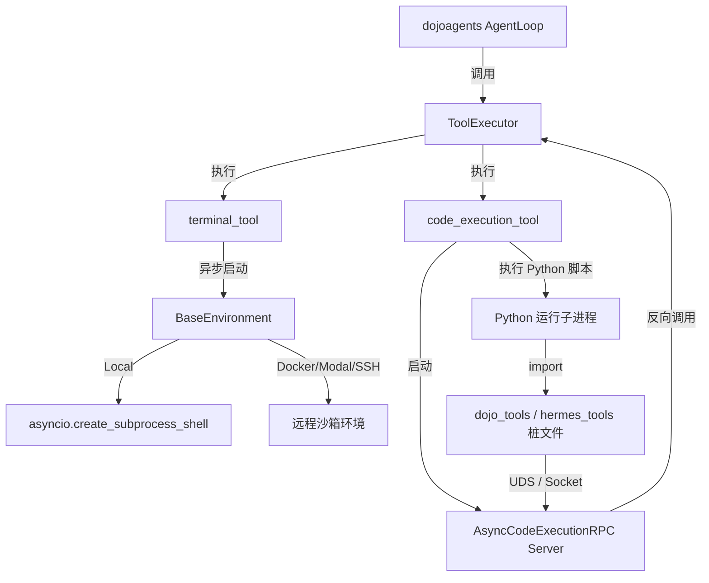

# 2026-05-26 DojoAgents 终端与代码执行能力设计文档

## 1. 目标描述

为 `DojoAgents` 赋予执行 Shell 脚本（Terminal）和运行 Python 脚本并能程序化反向调用内置工具（Code Execution / Programmatic Tool Calling）的能力。这需要将 `hermes-agent` 中经过实战验证的跨环境（Local, Docker, Modal, SSH）执行后端、后台任务管理系统和 PTC RPC 架构完整迁移到 `dojoagents`，并针对 `dojoagents` 的原生异步架构进行协程化重构。

---

## 2. 系统架构设计

系统包含四个核心组件：
1. **统一的异步环境接口 (`BaseEnvironment` & 后端实现)**：重构为基于协程的异步执行环境。
2. **异步后台进程管理器 (`AsyncProcessRegistry`)**：利用 `asyncio.subprocess.Process` 托管后台进程，在完成时发出通知触发 Agent 新的推理 Turn。
3. **原生异步 PTC RPC 通信层 (`AsyncCodeExecutionRPC`)**：在宿主父进程中使用 `asyncio.start_unix_server` 提供无阻塞工具分发，在脚本子进程中使用桩文件阻塞调用。
4. **工具注册表 (`dojo.tools.terminal` & `dojo.tools.execute_code`)**：作为 Core Tools 暴露给 `dojoagents` 的 Agent 决策机制。

---

## 3. 详细设计与实现细节

### 3.1 统一的异步环境层

重构 `dojoagents.tools.environments.local.LocalEnvironment`，引入如下特性：
- **流式 IO 传输**：放弃 `select.select()` 阻塞轮询，采用原生的 `asyncio.subprocess.PIPE` 与 `process.communicate()` 挂起等待。
- **工作路径持久化**：命令末尾插入 CWD 获取逻辑并将路径重定向至临时文件，在命令执行完毕后异步读取文件并更新 `self.cwd`。
- **安全沙箱控制**：与 `dojoagents` 原有的 `SandboxPolicy` 绑定，在执行前校验可执行指令和操作根目录。

### 3.2 异步 PTC (Programmatic Tool Calling)

在 `dojoagents/tools/code_execution_tool.py` 中实现全新的 PTC：
- **UDS/TCP 异步 Socket 服务器**：
  - Unix 系统下监听 `/tmp/dojo-rpc-{session_id}.sock`。
  - Windows 系统下监听 `127.0.0.1:{port}` 回环 TCP。
  - 核心处理协程（`handle_client`）通过流接口 `reader.readline()` 循环读取 JSON 数据包。
  - 接收到请求后，将其组装成 `ToolCall`，直接调用 `await tool_executor.execute_one(...)`。这样能在同一个 asyncio loop 中直接调度其它量化工具（如 `dojo.market.snapshot`），避免产生死锁或嵌套 loop 报错。
- **远程 File-based RPC 异步化**：
  - 当在 Docker、Modal 等隔离容器内运行时，使用基于文件的 RPC 通信通道。
  - 父进程启动一个异步轮询协程，每隔 50ms 异步读取远端目录下的 `req_*` 请求文件，分发并执行完毕后，回写 `res_*` 响应文件，全部操作使用异步文件访问。
- **Stub (桩) 文件生成**：
  - 运行 LLM 的 Python 代码前，在临时目录中生成一个定制的 `hermes_tools.py` 桩模块。
  - 桩模块对 LLM 暴露安全的 `dojo_market_snapshot`, `read_file`, `write_file`, `terminal` 等函数。

### 3.3 后台任务通知管理 (Background & Notification)

- **后台运行管理**：通过 `AsyncProcessRegistry` 管理所有以 `background=True` 运行的异步进程。
- **心跳与状态轮询**：每隔数秒异步检查活跃状态。
- **通知机制 (`notify_on_complete`)**：当后台任务完成时，通过 `dojoagents` 的消息通道向聊天会话发送一条 `[Background Task Complete]` 的事件消息，从而唤醒 Agent 发起下一轮 Turn，以解析最新的任务成果。

---

## 4. 安全防护与沙箱策略

- **危险指令扫描**：将 `tirith_security` 的简化版规则注入 `dojoagents/tools/environments/` 中，默认拦截对核心系统目录的破坏性指令（如 `rm -rf /`，未授权更改 hosts 等）。
- **Sudo 输入挂起**：提供非阻塞的 sudo 提示，或读取配置文件/环境变量中的 `SUDO_PASSWORD`。
- **脱敏机制 (Secrets Redaction)**：对于输出的内容，使用敏感关键词过滤器（过滤 API_KEY, PASSWORD, TOKEN 等）进行屏蔽后再呈现给 LLM。

---

## 5. 测试与验证计划

### 5.1 自动化测试
1. **LocalEnvironment 异步命令执行测试**：验证 CWD 维持、超时拦截及退出码解释器。
2. **异步 RPC Server 通信测试**：使用 Mock Tool 模拟 PTC 机制，测试双向 Socket 请求/响应。
3. **Docker 隔离运行测试**：测试容器启动、文件挂载和 File-based RPC。
4. **后台任务与通知测试**：测试异步唤醒事件。

### 5.2 手动测试
- 编写一段复杂的 Python 脚本让 LLM 调用，该脚本需在循环中调用 `dojo.market.snapshot` 并利用 `read_file` 交互分析，检验整个 PTC 闭环的可靠性。
